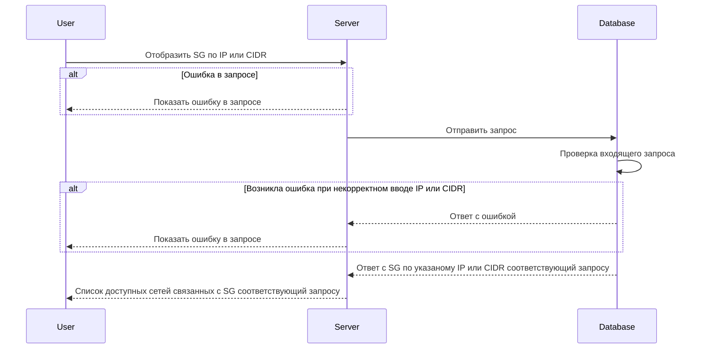

# GET /v1/\{address\}/sg

## **Запрос**

`GET /v1/{address}/sg`

## **Ответ**

```json
 {
  "logs": false,
  "name": "sg-4",
  "trace": false,
  "networks": [
    "nw-5" 
   ],
  "defaultAction": "DROP"
 }
```

## **Входные параметры**

| № | Параметр | Тип данных | Обязательность | Описание | Варианты значений |
| --- | --- | --- | --- | --- | --- |
| 1 | \{address\} | string | да | IP или CIDR | 10\.150.0.224/32 |

## **Проверки**

| Параметр | Условие |
| --- | --- |
| \{address\} | \- необходимо указать значение в формате IP (10.150.0.224) |

## **Выходные параметры**

### **Положительный ответ**

| № | Параметр | Тип данных | Описание | Варианты значений |
| --- | --- | --- | --- | --- |
| 1 | logs | bool | включено или выключено логирование (по умолчанию выключено) | true/false |
| 1\.1 | name | string | уникальное имя security group | sg-0 |
| 1\.2 | trace | bool | включена или выключена трассировка(по умолчанию выключена) | true/false |
| 1\.3 | networks | array of strings | массив уникальных имен сети | "nw-0", "nw-1" |
| 1\.4 | defaultAction | string |  | "DROP"/"ACCEPT" |

### **Ответ с ошибками**

Код ошибки 400

* Указано значение не является ни IP ни CIDR

```json
 {
  "code": 3,
  "details":  [],
  "message": "invalid request: no address is provided"
 }
```

* Указано значение в формате CIDR (10.10.0.8/30)

```json
 {
  "code": 5,
  "details":  [],
  "message": "Not Found"
 }
```

Код ошибки 400

* Ошибка в запросе

```json
 {
  "code": 5,
  "details":  [],
  "message": "Not Found"
 }
```

## **Описание интеграции**

