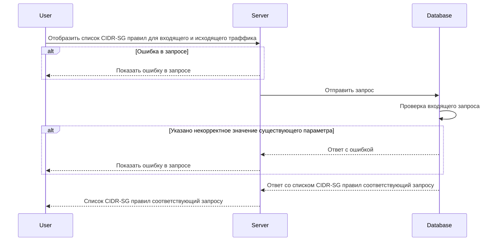

# POST /v1/cidr-sg/rules

## **Запрос**

`POST /v1/cidr-sg/rules`

* если в теле запроса указать одно или более sg - значений из имён источников Security Groups (sg), то получим ответ по указанным cidr-sg правилам
* если в теле запроса указать пустой массив sg, то получим ответ со всеми существующими cidr-sg правилами
* если указано некорректное тело в запросе, то получим ответ со всеми существующими cidr-sg правилами

```json
{
  "sg": [
    "sg-0"
  ]
}
```

## **Ответ**

```json
{
  "rules": [
    {
      "CIDR": "10.10.0.8/30",
      "SG": "sg-0",
      "logs": true,
      "ports": [
        {
          "d": "7800",
          "s": "4446"
        }
      ],
      "trace": true,
      "traffic": "Ingress",
      "transport": "TCP"
    }
  ]
}
```

## **Входные параметры**

| № | Параметр | Тип данных | Обязательность | Описание | Варианты значений |
| --- | --- | --- | --- | --- | --- |
| 1 | sg | array of strings | да | массив из имен источников SG | sg-11 |

## **Проверки**

| Параметр | Условие |
| --- | --- |
| sg | \- длина значения не должна превышать 256 символов<br />\- значение должно начинаться и заканчиваться символами без пробелов |

## **Выходные параметры**

### **Положительный ответ**

| № | Параметр | Тип данных | Описание | Варианты значений |
| --- | --- | --- | --- | --- |
| 1 | rules | array of objects |  | \- |
| 1\.1 | rules[].CIDR | string |  | 10\.10.0.8/30 |
| 1\.2 | rules[].sg | string | название Security group | sg-0 |
| 1\.3 | rules[].logs | bool | включено или выключено логирование (по умолчанию выключено) | true/false |
| 1\.4 | rules[].ports | array of objects |  | \- |
| 1\.4.1 | rules[].ports[].d | string | значения портов входящего трафика | "7600-7700,7800" |
| 1\.4.2 | rules[].ports[].s | string | значения портов исходящего трафика | "4446" |
| 1\.5 | rules[].sgFrom | string | название Security group | sg-0 |
| 1\.6 | rules[].trace | bool | включена или выключена трассировка (по умолчанию выключена) | true/false |
| 1\.7 | rules[].traffic | string | тип траффика (входящий/исходящий) | "Undef"/"Ingress"/"Egress" |
| 1\.5 | rules[].transport | string | метод передачи данных | "TCP"/"UDP" |

### **Ответ с ошибками**

Код ошибки 400

* Указано некорректное значение существующего параметра

```json
   {
    "code": 3,
    "details":  [],
    "message": "proto: syntax error (line __): unexpected token \"string\""
   }
```

Код ошибки 404

* Ошибка в запросе

```json
 {
  "code": 5,
  "details":  [],
  "message": "Not Found"
 }
```

## **Описание интеграции**

