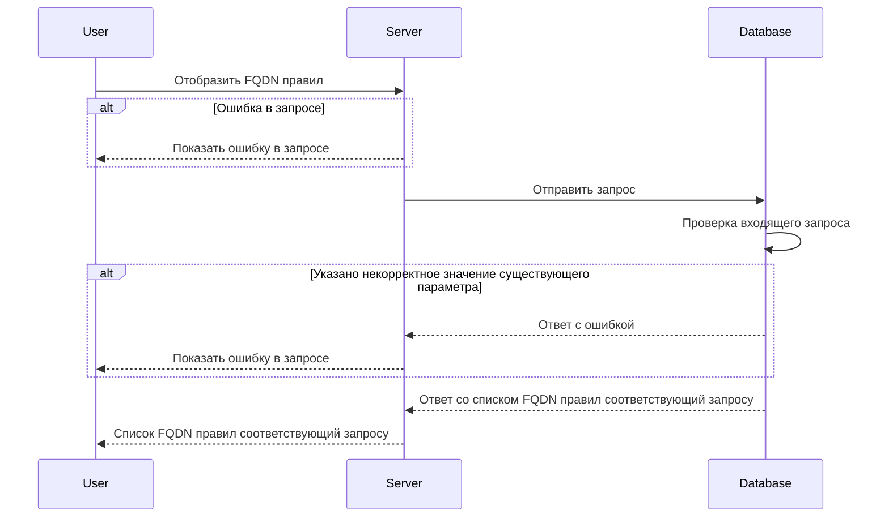

# POST /v1/fqdn/rules

## **Запрос**

`POST /v1/fqdn/rules`

* если в теле запроса указать одно или более sgFrom - значений из имён источников Security Groups (sg), то получим ответ по указанным fqdn правилам
* если в теле запроса указать пустой массив sgFrom, то получим ответ со всеми существующими fqdn правилами
* если указано некорректное тело в запросе, то получим ответ со всеми существующими fqdn правилами

```json
{
  "sgFrom": [
    "sg-0"
  ]
}
```

## **Ответ**

```json
 {
  "rules": [
     {
     "FQDN": "google.com",
     "logs": true,
     "ports": [
        {
        "d": "7600-7700,7800",
        "s": "4446"
       } 
      ],
     "sgFrom": "sg-0",
     "transport": "TCP",
     "protocols": [
          "http",
          "ssh"
      ] 
    } 
   ] 
 }
```

## **Входные параметры**

| № | Параметр | Тип данных | Обязательность | Описание | Варианты значений |
| --- | --- | --- | --- | --- | --- |
| 1 | sgFrom | array of strings | да | массив из имен источников SG | sg-11 |

## **Проверки**

| Параметр | Условие |
| --- | --- |
| sgFrom | \- длина значения не должна превышать 256 символов<br />\- значение должно начинаться и заканчиваться символами без пробелов |

## **Выходные параметры**

### **Положительный ответ**

| № | Параметр | Тип данных | Описание | Варианты значений |
| --- | --- | --- | --- | --- |
| 1 | rules | array of objects |  | \- |
| 1\.1 | rules[].FQDN | string | полное доменное имя | google.com |
| 1\.2 | rules[].logs | bool | включено или выключено логирование (по умолчанию выключено) | true/false |
| 1\.3 | rules[].ports | array of objects |  | \- |
| 1\.3.1 | rules[].ports[].d | string | значения портов входящего трафика | "7600-7700,7800" |
| 1\.3.2 | rules[].ports[].s | string | значения портов исходящего трафика | "4446" |
| 1\.4 | rules[].sgFrom | string | название Security group | sg-0 |
| 1\.5 | rules[].transport | string | метод передачи данных | "TCP"/"UDP" |
| 1\.6 | rules[].protocols[] | array of strings | значения протоколов | "http", "ssh" |

### **Ответ с ошибками**

Код ошибки 400

* Указано некорректное значение существующего параметра

```json
   {
    "code": 3,
    "details":  [],
    "message": "proto: syntax error (line __): unexpected token \"string\""
   }
```

Код ошибки 404

* Ошибка в запросе

```json
 {
  "code": 5,
  "details":  [],
  "message": "Not Found"
 }
```

## **Описание интеграции**

