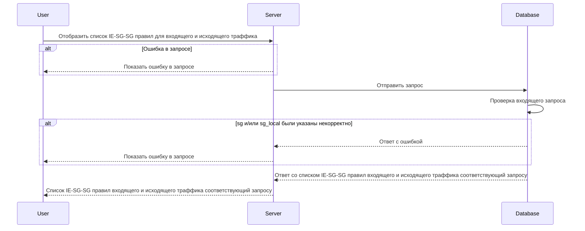

# POST v1/ie-sg-sg/rules

## **Запрос**

`POST v1/ie-sg-sg/rules`

* если в теле запроса указано одно или более значений в обоих массивах sg -\> sg_local, то получим ответ всех существующих комбинаций правил IE-SG-SG каждого указанного значения sg с каждым указанным значением sg_local (value-to-value)
* если в теле запроса один из массивов пустой а во втором указаны от одного и более значений, то получим ответ всех существующих комбинаций правил IE-SG-SG каждого указанного значения со всеми существующими (any-to-value, value-to-any)
* если в теле запроса указаны пустые массивы sg -\> sg_local, то получим ответ всех существующих комбинаций правил IE-SG-SG (any-to-any)
* если указано некорректное тело в запросе, то получим ответ всех существующих комбинаций правил IE-SG-SG (any-to-any)

```json
{
  "sg": [
    "sg-1"
  ],
  "sg_local": [
    "sg-2"
  ]
}
```

## **Ответ**

```json
{
  "rules": [
    {
        "sg": "sg-1",
        "sg_local": "sg-2",
        "logs": true,
        "trace": true,
        "ports": [
          {
            "d": "7800",
            "s": "4446"
          }
        ],
        "traffic": "Ingress",
        "transport": "TCP"
      }
  ]
}
```

## **Входные параметры**

| № | Параметр | Тип данных | Обязательность | Описание | Варианты значений |
| --- | --- | --- | --- | --- | --- |
| 1 | sg | array of strings | да | массив из имен источников SG | sg-11 |
| 2 | sg_local | array of strings | да | массив из имен источников SG | sg-12 |

## **Проверки**

| Параметр | Условие |
| --- | --- |
| sg | \- длина значения не должна превышать 256 символов<br />\- значение должно начинаться и заканчиваться символами без пробелов |
| sg_local | \- длина значения не должна превышать 256 символов<br />\- значение должно начинаться и заканчиваться символами без пробелов |

## **Выходные параметры**

### **Положительный ответ**

| № | Параметр | Тип данных | Описание | Варианты значений |
| --- | --- | --- | --- | --- |
| 1 | rules | array of objects |  | \- |
| 1\.2 | rules[].sg | string | название Security group | sg-0 |
| 1\.3 | rules[].sg_local | string | название Security group | sg-0 |
| 1\.4 | rules[].logs | bool | включено или выключено логирование (по умолчанию выключено) | true/false |
| 1\.5 | rules[].trace | bool | включена или выключена трассировка (по умолчанию выключена) | true/false |
| 1\.6 | rules[].ports | array of objects |  | \- |
| 1\.6.1 | rules[].ports[].d | string | значения портов входящего трафика | "7600-7700,7800" |
| 1\.6.2 | rules[].ports[].s | string | значения портов исходящего трафика | "4446" |
| 1\.7 | rules[].traffic | string | тип траффика (входящий/исходящий) | "Undef"/"Ingress"/"Egress" |
| 1\.8 | rules[].transport | string | метод передачи данных | "TCP"/"UDP" |

### **Ответ с ошибками**

Код ошибки 400

* Если sg или sg_local были указаны некорректно:
  \- ошибка, если значения были указаны не как массив, а как одно значение
  \- ошибка, если значение sg или sg_local не соответствует формату названия security group (длина значения не должна превышать 256 символов, значения должно начинаться и заканчиваться символами без пробелов, значение должно быть уникальным)

```json
   {
    "code": 3,
    "details":  [],
    "message": "proto: syntax error (line __): unexpected token \"string\""
   }
```

Код ошибки 404

* Опечатка в имени метода

```json
 {
  "code": 5,
  "details":  [],
  "message": "Not Found"
 }
```

## **Описание интеграции**

