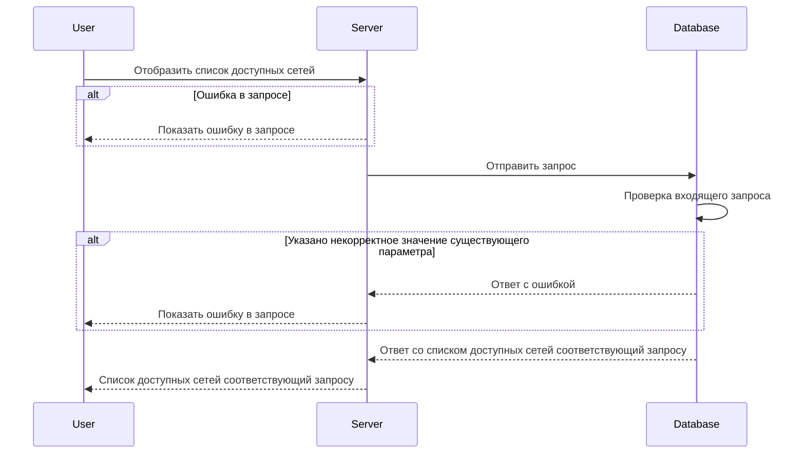

# POST /v1/list/networks

## **Запрос**

`POST /v1/list/networks`

* если в теле запроса указать одно или более neteworksNames - массив из уникальных имён сети, то получим ответ по указанным сетям
* если в теле запроса указать пустое тело, то получим ответ со всеми существующими сетями
* если указано некорректное тело в запросе, то получим ответ со всеми существующими сетями

```json
{
  "neteworkNames": [
    "nw-0"
  ]
}
```

## **Ответ**

```json
 {
  "networks": [
     {
     "name": "nw-0",
     "network":  {
       "CIDR": "10.150.0.220/32"
      }
    }
   ]
}
```

## **Входные параметры**

| № | Параметр | Тип данных | Обязательность | Описание | Варианты значений |
| --- | --- | --- | --- | --- | --- |
| 1 | neteworkNames | array of strings | да | массив из уникальных имён сети | nw-1 |

## **Проверки**

| Параметр | Условие |
| --- | --- |
| neteworkNames | \- длина значения не должна превышать 256 символов<br />\- значение должно начинаться и заканчиваться символами без пробелов |

## **Выходные параметры**

### **Положительный ответ**

| № | Параметр | Тип данных | Описание | Варианты значений |
| --- | --- | --- | --- | --- |
| 1 | networks | array of objects |  | \- |
| 1\.1 | networks[].names | string | уникальное имя сети | nw-0 |
| 1\.2 | networks[].network | object |  | \- |
| 1\.3 | networks[].network.CIDR | string |  | 10\.150.0.220/32 |

### **Ответ с ошибками**

Код ошибки 400

* Указано некорректное значение существующего параметра

  ```json
   {
    "code": 3,
    "details":  [],
    "message": "proto: syntax error (line __): unexpected token \"string\""
   }
  
  ```

Код ошибки 404

* Ошибка в запросе

```json
 {
  "code": 5,
  "details":  [],
  "message": "Not Found"
 }
```

## **Описание интеграции**

