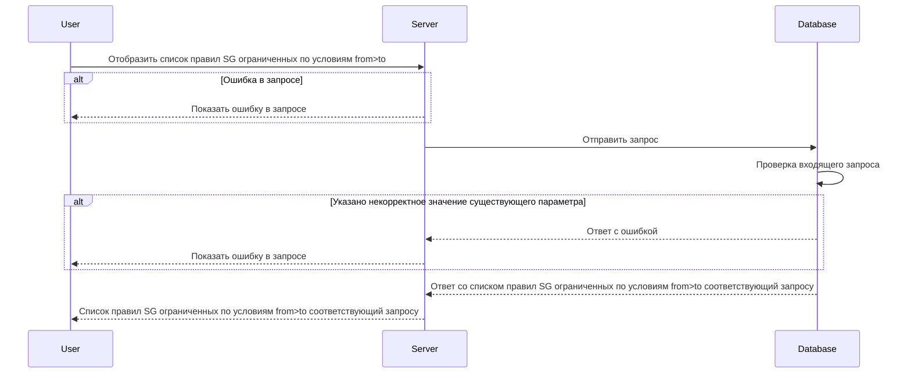

# POST /v1/rules

## **Запрос**

`POST /v1/rules`

* если в теле запроса указано одно или более значений в обоих массивах sgFrom -\> sgTo, то получим ответ всех существующих комбинаций каждого указанного значения sgFrom с каждым указанным значением sgTo (value-to-value)
* если в теле запроса один из массивов пустой а во втором указаны от одного и более значений, то получим ответ всех существующих комбинаций каждого указанного значения со всеми существующими (any-to-value, value-to-any)
* если в теле запроса указаны пустые массивы sgFrom -\> sgTo, то получим ответ всех существующих комбинаций (any-to-any)
* если указано некорректное тело в запросе, то получим ответ всех существующих комбинаций (any-to-any)

```json
{
  "sgFrom": [
    "sg-0"
  ],
  "sgTo": [
    "sg-1"
  ]
}
```

## **Ответ**

```json
 {
  "rules": [
     {
     "logs": false,
     "sgTo": "sg-0",
     "ports": [
        {
        "d": "5000",
        "s": ""
       } 
      ],
     "sgFrom": "sg-1",
     "transport": "TCP"
    }
}
```

## **Входные параметры**

| № | Параметр | Тип данных | Обязательность | Описание | Варианты значений |
| --- | --- | --- | --- | --- | --- |
| 1 | sgFrom | array of strings | да | массив из уникальных имен SG (SF FROM) | sg-0 |
| 2 | sgTo | array of strings | да | массив из уникальных имен SG (SF TO) | SG-11 |

## **Проверки**

| Параметр | Условие |
| --- | --- |
| sgFrom | \- длина значения не должна превышать 256 символов<br />\- значение должно начинаться и заканчиваться символами без пробелов |
| sgTo | \- длина значения не должна превышать 256 символов<br />\- значение должно начинаться и заканчиваться символами без пробелов |

## **Выходные параметры**

### **Положительный ответ**

| № | Параметр | Тип данных | Описание | Варианты значений |
| --- | --- | --- | --- | --- |
| 1 | rules | array of objects |  | \- |
| 1\.1 | rules[].logs | bool | включено или выключено логирование (по умолчанию выключено) | true/false |
| 1\.2 | rules[].sgTo | string | уникальное имя security group (sg to) | sg-0 |
| 1\.3 | rules[].ports | array of objects |  | \- |
| 1\.3.1 | rules[].ports[].d | string | значения портов входящего трафика | "7600-7700,7800" |
| 1\.3.2 | rules[].ports[].s | string | значения портов исходящего трафика | "4446" |
| 1\.4 | rules[].sgFrom | string | уникальное имя security group (sg from) | sg-0 |
| 1\.5 | rules[].transport | string | метод передачи данных | TCP/UDP |

### **Ответ с ошибками**

Код ошибки 400

* Указано некорректное значение существующего параметра

  ```json
   {
    "code": 3,
    "details":  [],
    "message": "proto: syntax error (line __): unexpected token \"string\""
   }
  
  ```

Код ошибки 404

* Ошибка в запросе

```json
 {
  "code": 5,
  "details":  [],
  "message": "Not Found"
 }
```

## **Описание интеграции**

