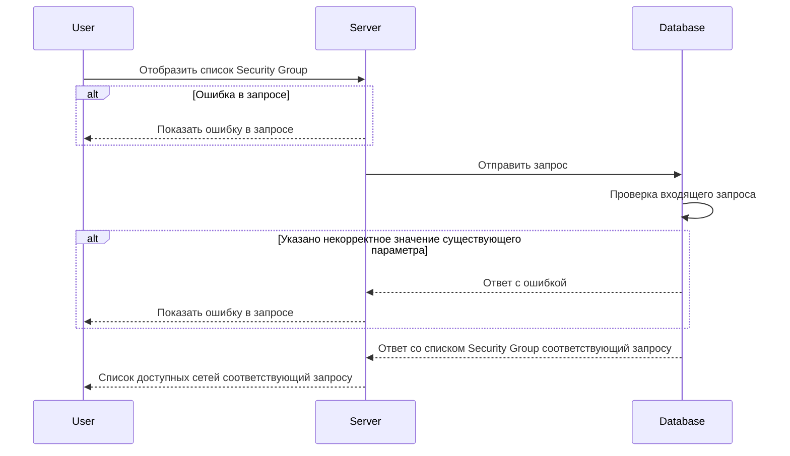

# POST /v1/list/security-groups

## **Запрос**

`POST /v1/list/security-groups`

<ul>
    <li>если в теле запроса указать одно или более sgNames - массив из уникальных имён SG, то получим ответ по указанным SG</li>
    <li>если в теле запроса указать пустое тело, то получим ответ со всеми существующими SG</li>
    <li>если указано некорректное тело в запросе, то получим ответ со всеми существующими SG</li>
</ul>

```json
{
  "sgNames": [
    "sg-0"
  ]
}
```

## **Ответ**

```json
 {
  "groups": [
     {
     "logs": false,
     "name": "sg-0",
     "trace": false,
     "networks": [
       "nw-0" ,
       "nw-1" 
      ],
     "defaultAction": "DROP"
    }
   ]
}
```

## **Входные параметры**

<table>
    <thead>
        <tr>
            <th>№</th>
            <th>Параметр</th>
            <th>Тип данных</th>
            <th>Обязательность</th>
            <th>Описание</th>
            <th>Варианты значений</th>
        </tr>
    </thead>
    <tbody>
        <tr>
            <td>1</td>
            <td>sgNames</td>
            <td>array of strings</td>
            <td>да</td>
            <td>массив из уникальных имён SG</td>
            <td>sg-11</td>
        </tr>
    </tbody>
</table>

## **Проверки**

<table>
    <thead>
        <tr>
            <th>Параметр</th>
            <th>Условие</th>
        </tr>
    </thead>
    <tbody>
        <tr>
            <td>sgNames</td>
            <td>\- длина значения не должна превышать 256 символов&lt;br /&gt;\- значение должно начинаться и заканчиваться символами без пробелов</td>
        </tr>
    </tbody>
</table>

## **Выходные параметры**

### **Положительный ответ**

<table>
    <thead>
        <tr>
            <th>№</th>
            <th>Параметр</th>
            <th>Тип данных</th>
            <th>Описание</th>
            <th>Варианты значений</th>
        </tr>
    </thead>
    <tbody>
        <tr>
            <td>1</td>
            <td>groups</td>
            <td>array of objects</td>
            <td></td>
            <td>\-</td>
        </tr>
        <tr>
            <td>1.1</td>
            <td>groups[].logs</td>
            <td>bool</td>
            <td>включено или выключено логирование (по умолчанию выключено)</td>
            <td>true/false</td>
        </tr>
        <tr>
            <td>1.2</td>
            <td>groups[].name</td>
            <td>string</td>
            <td>уникальное имя security group</td>
            <td>sg-0</td>
        </tr>
        <tr>
            <td>1.3</td>
            <td>groups[].trace</td>
            <td>bool</td>
            <td>включена или выключена трассировка(по умолчанию выключена)</td>
            <td>true/false</td>
        </tr>
        <tr>
            <td>1.4</td>
            <td>groups[].networks</td>
            <td>array of strings</td>
            <td>массив уникальных имен сетей</td>
            <td>&quot;nw-1&quot;, &quot;nw-2&quot;</td>
        </tr>
        <tr>
            <td>1.5</td>
            <td>groups[].defaultAuction</td>
            <td>string</td>
            <td>действие по умолчанию для пакетов данных</td>
            <td>&quot;DROP&quot;/&quot;ACCEPT&quot;</td>
        </tr>
    </tbody>
</table>

### **Ответ с ошибками**

<table>
    <thead>
        <tr>
            <th>Код</th>
            <th>Описание</th>
        </tr>
    </thead>
    <tbody>
        <tr>
            <td>400</td>
            <td>Указано некорректное значение существующего параметра</td>
        </tr>
        <tr>
            <td>404</td>
            <td>Ошибка в запросе</td>
        </tr>
    </tbody>
</table>

## **Описание интеграции**

