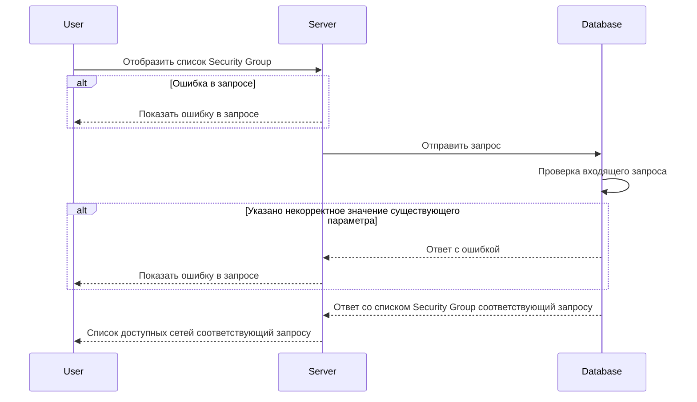

# POST /v1/list/security-groups

## **Запрос**

`POST /v1/list/security-groups`

* если в теле запроса указать одно или более sgNames - массив из уникальных имён SG, то получим ответ по указанным SG
* если в теле запроса указать пустое тело, то получим ответ со всеми существующими SG
* если указано некорректное тело в запросе, то получим ответ со всеми существующими SG

```json
{
  "sgNames": [
    "sg-0"
  ]
}
```

## **Ответ**

```json
 {
  "groups": [
     {
     "logs": false,
     "name": "sg-0",
     "trace": false,
     "networks": [
       "nw-0" ,
       "nw-1" 
      ],
     "defaultAction": "DROP"
    }
   ]
}
```

## **Входные параметры**

| № | Параметр | Тип данных | Обязательность | Описание | Варианты значений |
| --- | --- | --- | --- | --- | --- |
| 1 | sgNames | array of strings | да | массив из уникальных имён SG | sg-11 |

## **Проверки**

| Параметр | Условие |
| --- | --- |
| sgNames | \- длина значения не должна превышать 256 символов<br />\- значение должно начинаться и заканчиваться символами без пробелов |

## **Выходные параметры**

### **Положительный ответ**

| № | Параметр | Тип данных | Описание | Варианты значений |
| --- | --- | --- | --- | --- |
| 1 | groups | array of objects |  | \- |
| 1\.1 | groups[].logs | bool | включено или выключено логирование (по умолчанию выключено) | true/false |
| 1\.2 | groups[].name | string | уникальное имя security group | sg-0 |
| 1\.3 | groups[].trace | bool | включена или выключена трассировка(по умолчанию выключена) | true/false |
| 1\.4 | groups[].networks | array of strings | массив уникальных имен сетей | "nw-1", "nw-2" |
| 1\.5 | groups[].defaultAuction | string | действие по умолчанию для пакетов данных | "DROP"/"ACCEPT" |

### **Ответ с ошибками**

| Код | Описание |
| --- | --- |
| 400 | Указано некорректное значение существующего параметра |
| 404 | Ошибка в запросе |

## **Описание интеграции**

