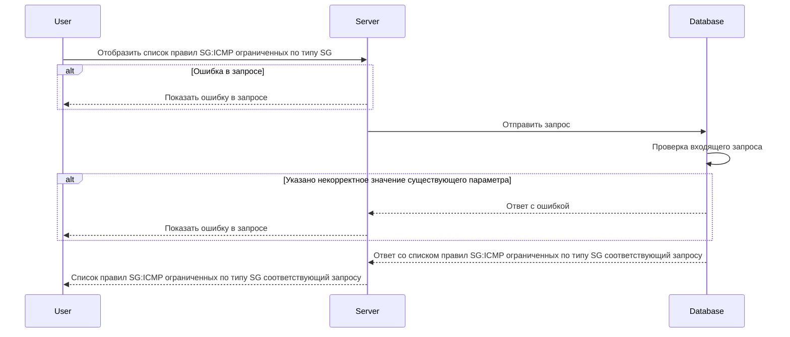

# POST /v1/sg-icmp/rules

## **Запрос**

`POST /v1/sg-icmp/rules`

* если в теле запроса указать одно или более sg - значений из имён источников Security Groups (sg), то получим ответ по указанным SG:ICMP правилам
* если в теле запроса указать пустой массив sgFrom или пустое тело запроса, то получим ответ со всеми существующими SG:ICMP правилами
* если указано некорректное тело в запросе, то получим ответ со всеми существующими SG:ICMP правилами

```json
{
  "sg": [
    "string"
  ]
}
```

## **Ответ**

```json
 {
  "rules": [
     {
     "Sg": "sg-0",
     "ICMP":  {
       "IPv": "IPv4",
       "Types": [
         0 
        ]
      },
     "logs": true,
     "trace": true
    }
   ]
 }
```

## **Входные параметры**

| № | Параметр | Тип данных | Обязательность | Описание | Варианты значений |
| --- | --- | --- | --- | --- | --- |
| 1 | sg | array of strings | lf | массив из уникальных имен SG | SG-11 |

## **Проверки**

| Параметр | Условие |
| --- | --- |
| sg | \- длина значения не должна превышать 256 символов<br />\- значение должно начинаться и заканчиваться символами без пробелов |

## **Выходные параметры**

### **Положительный ответ**

| № | Параметр | Тип данных | Описание | Варианты значений |
| --- | --- | --- | --- | --- |
| 1 | rules | array of objects |  | \- |
| 1\.1 | rules[].Sg | string | уникальное имя security group | sg-0 |
| 1\.2 | rules[].ICMP | object |  | \- |
| 1\.2.1 | rules[].ICMP.IPv | string | версия интернет-протокола | IPv4/IPv6 |
| 1\.2.2 | rules[].ICMP.Types | array of integers | массив кодов типа ICMP | 0, 8, 100 |
| 1\.3 | rules[].logs | bool | включено или выключено логирование (по умолчанию выключено) | true/false |
| 1\.4 | rules[].trace | bool | включена или выключена трассировка(по умолчанию выключена) | true/false |

### **Ответ с ошибками**

Код ошибки 400

* Указано некорректное значение существующего параметра

```json
   {
    "code": 3,
    "details":  [],
    "message": "proto: syntax error (line __): unexpected token \"string\""
   }
```

Код ошибки 404

* Ошибка в запросе

```json
 {
  "code": 5,
  "details":  [],
  "message": "Not Found"
 }
```

## **Описание интеграции**

