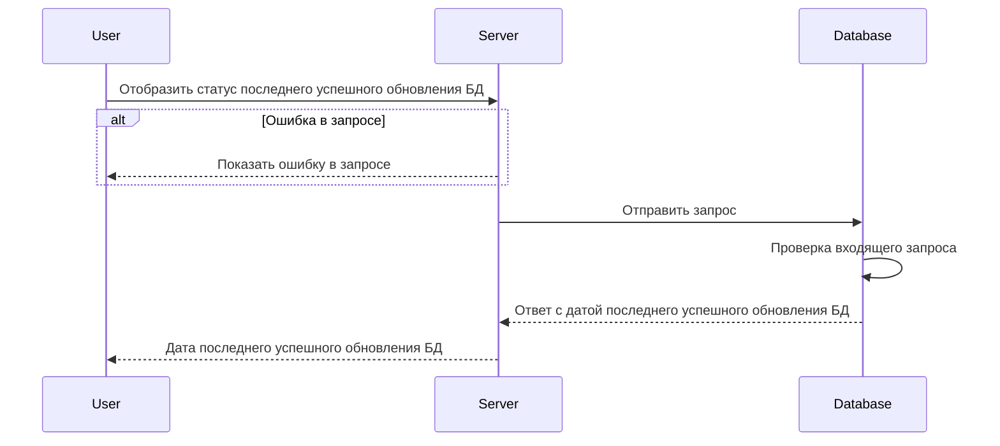

# GET /v1/sync/status

## **Запрос**

`GET /v1/sync/status`

## **Ответ**

```json
 {
  "updatedAt": "2023-11-21T17:02:30.717786Z"
 }
```

## **Выходные параметры**

### **Положительный ответ**

| № | Параметр | Тип данных | Описание | Варианты значений |
| --- | --- | --- | --- | --- |
| 1 | updatedAt | string | дата последнего успешного изменения | 2023-11-21T17:02:30.717786Z |

### **Ответ с ошибками**

Код ошибки 404

* Ошибка в запросе

```json
 {
  "code": 5,
  "details":  [],
  "message": "Not Found"
 }
```

## **Описание интеграции**

