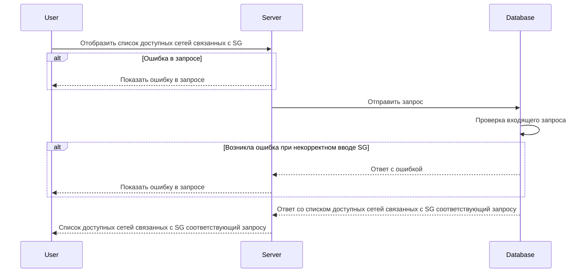

# GET /v1/sg/\{sgName\}/subnets

## **Запрос**

`GET /v1/sg/{sgName}/subnets`

## **Ответ**

```json
 {
  "networks": [
     {
     "name": "nw-2",
     "network":  {
       "CIDR": "10.150.0.222/32"
      }
    } 
   ]
 }
```

## **Входные параметры**

| № | Параметр | Тип данных | Обязательность | Описание | Варианты значений |
| --- | --- | --- | --- | --- | --- |
| 1 | \{sgName\} | string | да | уникальное имя sg | SG-11 |

## **Проверки**

| Параметр | Условие |
| --- | --- |
| \{sgName\} | \- длина значения не должна превышать 256 символов<br />\- значение должно начинаться и заканчиваться символами без пробелов |

## **Выходные параметры**

### **Положительный ответ**

| № | Параметр | Тип данных | Описание | Варианты значений |
| --- | --- | --- | --- | --- |
| 1 | networks | array of objects |  | \- |
| 1\.1 | networks[].name | string | уникальное имя сети | nw-1 |
| 1\.2 | networks[].network | object |  | \- |
| 1\.3 | networks[].network.CIDR | string |  | 10\.150.0.220/32 |

### **Ответ с ошибками**

Код ошибки 404

* Указано неверное значение \{sgName\}

```json
 {
  "code": 5,
  "details":  [],
  "message": "SG 'string' is not found"
 }
```

* Ошибка в запросе

```json
 {
  "code": 5,
  "details":  [],
  "message": "Not Found"
 }
```

## **Описание интеграции**

