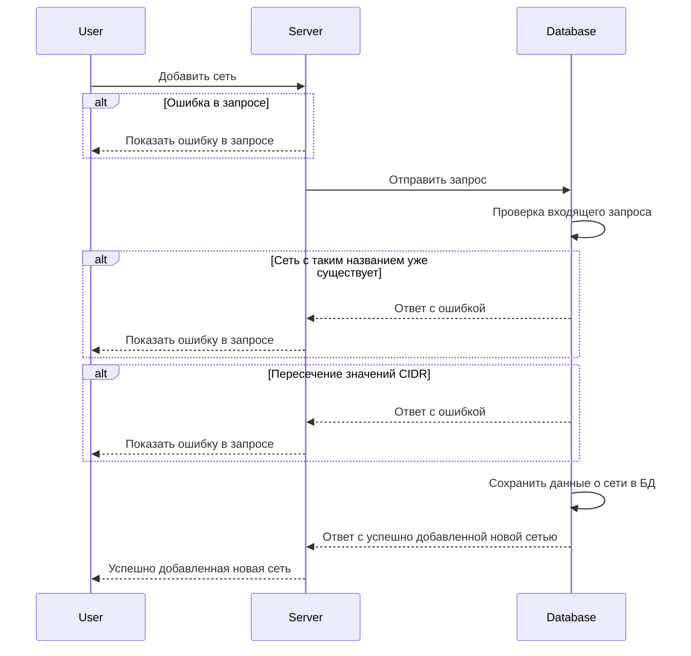
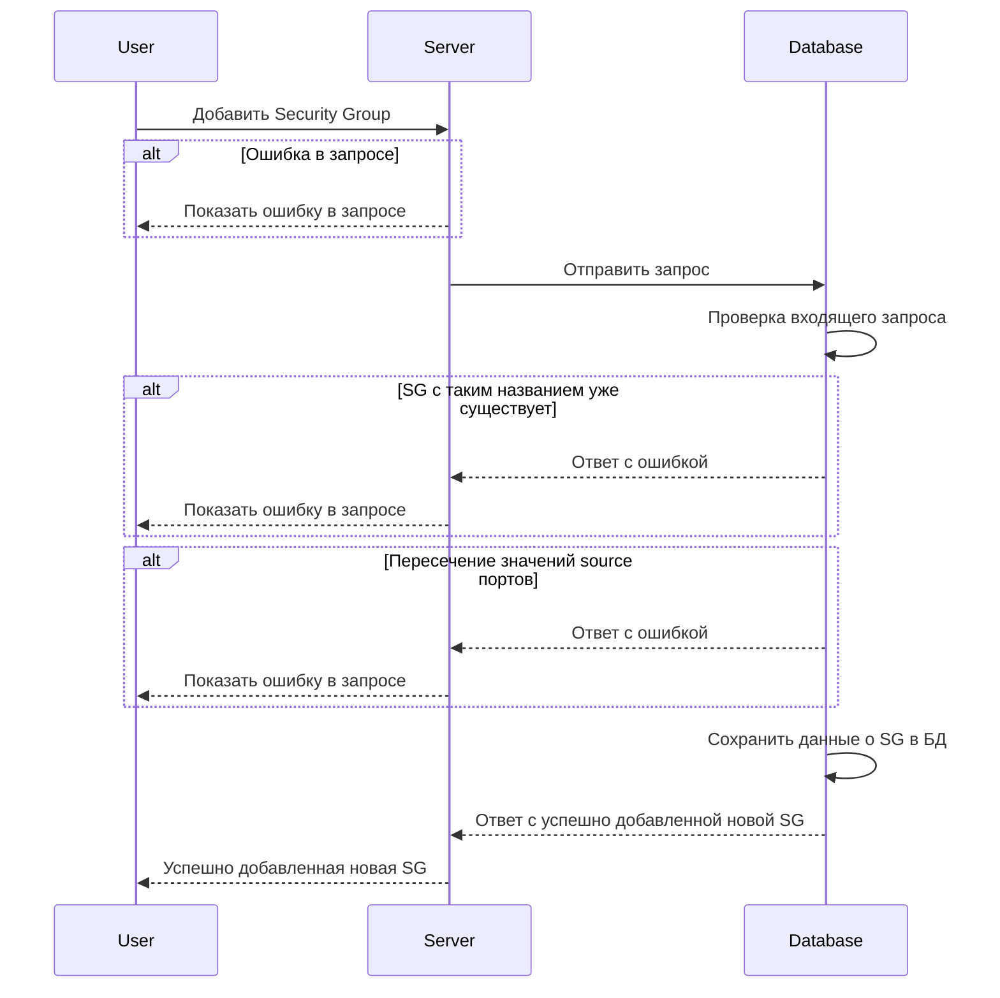
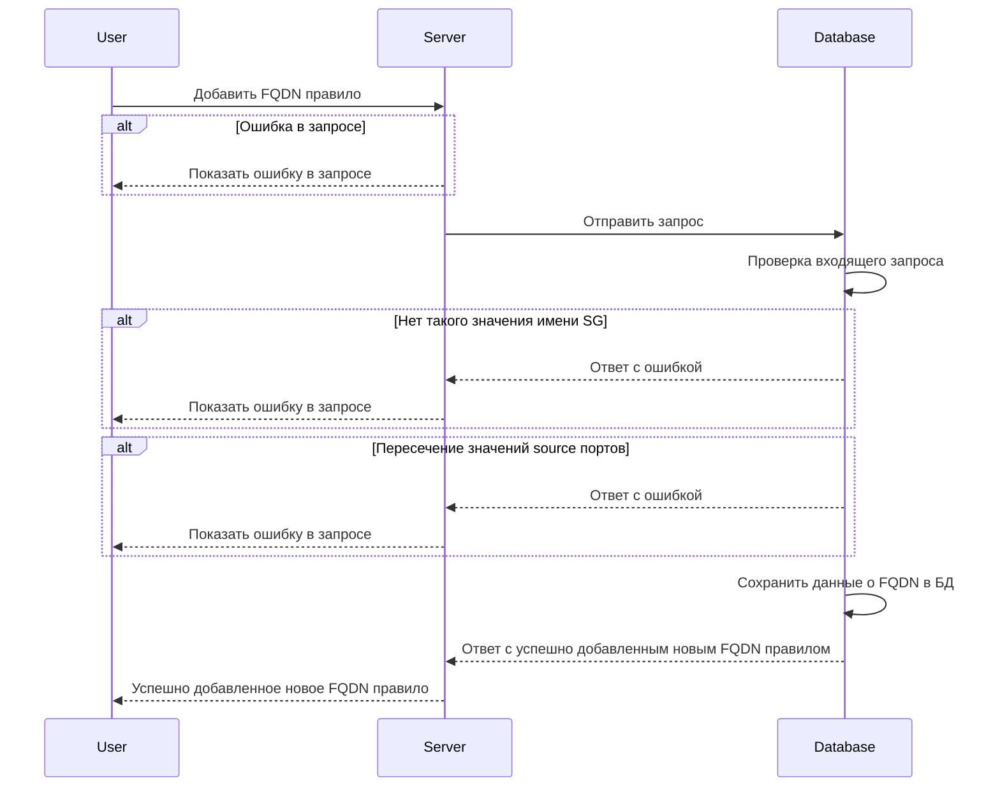
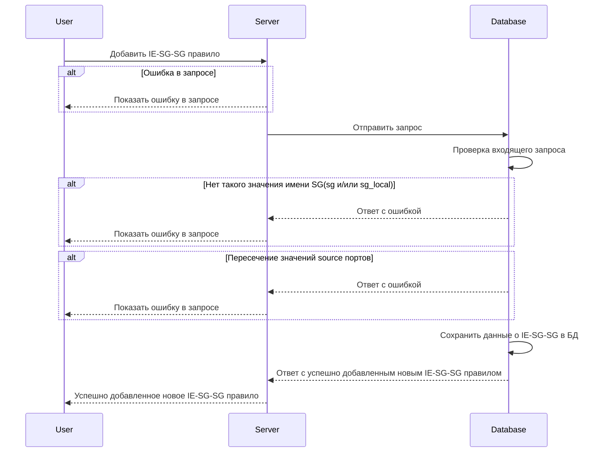
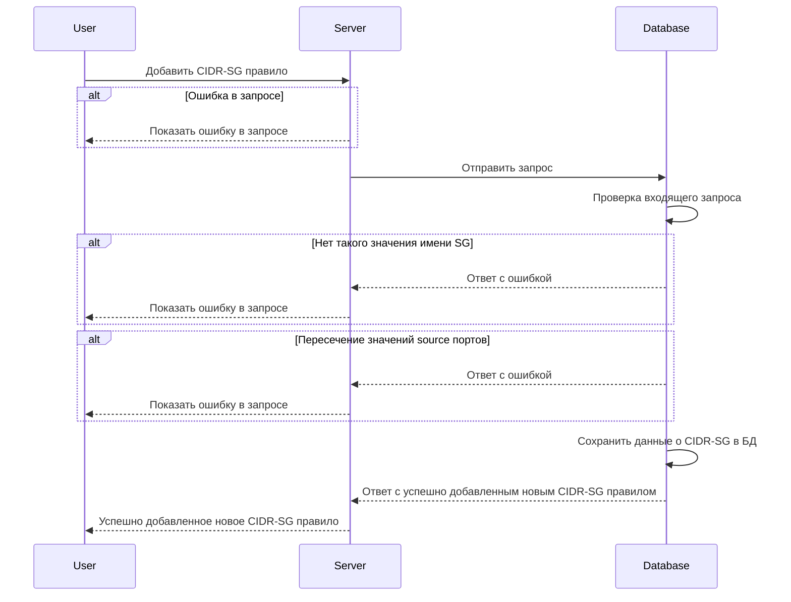
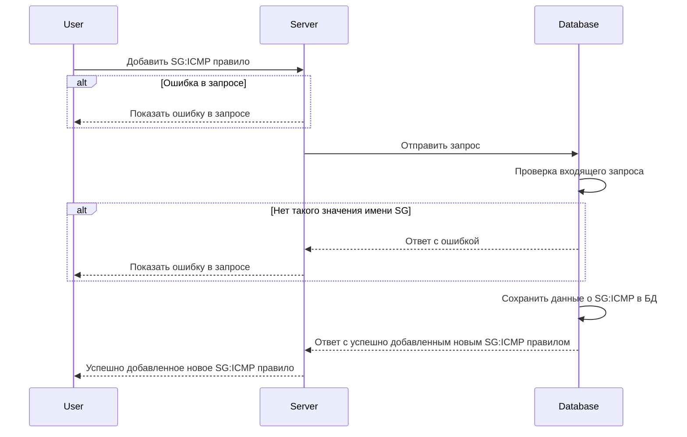
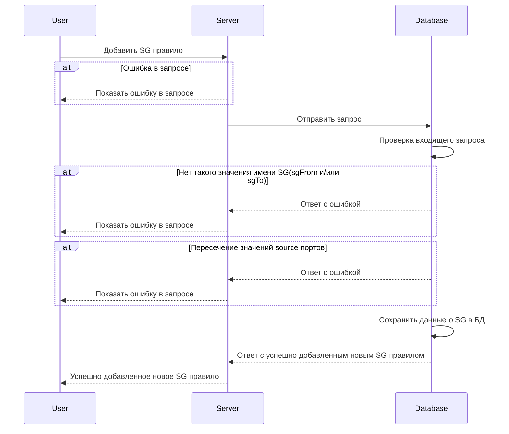

import Tabs from '@theme/Tabs';
import TabItem from '@theme/TabItem';

# POST /v1/sync

## **Запрос**

`POST /v1/sync`

* можно отдельно добавить/удалить сеть (network) указав в теле только 5 и 9 пункты из входных параметров, при удалении сети все принадлежащие ей security group и правила так же будут удалены
* можно отдельно добавить/удалить security group (sg) указав в теле только 4 и 9 пункты из входных параметров (предварительно необходимо создать сеть по которой будет сформирована security group), при удалении security group все принадлежащие ей правила так же будут удалены
* можно отдельно добавить/удалить каждое из правил (предварительно для правила должны быть создана сеть и security group)
  * для добавления/удаления FQDN правил, в теле необходимо указать 3 и 9 пункты из входных параметров
  * для добавления/удаления CIDR-SG правил, в теле необходимо указать 2 и 9 пункты из входных параметров
  * для добавления/удаления SG:ICMP правил, в теле необходимо указать 6 и 9 пункты из входных параметров
  * для добавления/удаления SG-SG:ICMP правил, в теле необходимо добавить 8 и 9 пункты из входных параметров
  * для добавления/удаления SG правил, в теле необходимо добавить 7 и 9 пункты из входных параметров
  * для добавления/удаления IE-SG-SG правил, в теле необходимо указать 1 и 9 пункты из входных параметров

```json
{
  "sgSgRules": {
    "rules": [
      {
        "sg": "string",
        "sg_local": "string",
        "logs": true,
        "trace": true,
        "ports": [
          {
            "d": "string",
            "s": "string"
          }
        ],
        "traffic": "Ingress",
        "transport": "TCP"
      }
    ]
  },
  "cidrSgRules": {
    "rules": [
      {
        "CIDR": "string",
        "SG": "string",
        "logs": true,
        "ports": [
          {
            "d": "string",
            "s": "string"
          }
        ],
        "trace": true,
        "traffic": "Undef",
        "transport": "TCP"
      }
    ]
  },
  "fqdnRules": {
    "rules": [
      {
        "FQDN": "string",
        "logs": true,
        "ports": [
          {
            "d": "string",
            "s": "string"
          }
        ],
        "sgFrom": "string",
        "transport": "TCP",
        "protocols": [
          "http",
          "ssh"
      ] 
      }
    ]
  },
  "groups": {
    "groups": [
      {
        "defaultAction": "DEFAULT",
        "logs": true,
        "name": "string",
        "networks": [
          "string"
        ],
        "trace": true
      }
    ]
  },
  "networks": {
    "networks": [
      {
        "name": "string",
        "network": {
          "CIDR": "string"
        }
      }
    ]
  },
  "sgIcmpRules": {
    "rules": [
      {
        "ICMP": {
          "IPv": "_",
          "Types": [
            0
          ]
        },
        "Sg": "string",
        "logs": true,
        "trace": true
      }
    ]
  },
  "sgRules": {
    "rules": [
      {
        "logs": true,
        "ports": [
          {
            "d": "string",
            "s": "string"
          }
        ],
        "sgFrom": "string",
        "sgTo": "string",
        "transport": "TCP"
      }
    ]
  },
  "sgSgIcmpRules": {
    "rules": [
      {
        "ICMP": {
          "IPv": "_",
          "Types": [
            0
          ]
        },
        "SgFrom": "string",
        "SgTo": "string",
        "logs": true,
        "trace": true
      }
    ]
  },
  "syncOp": "FullSync"
}
```

## **Ответ**

```json
 {

 }
```

## **Входные параметры**

| № | Параметр | Тип данных | Обязательность | Описание | Варианты значений |
| --- | --- | --- | --- | --- | --- |
| 1 | sgSgRules | objects of objects | нет |  | \- |
| 1\.2 | sgSgRules.rules | array of objects | нет |  | \- |
| 1\.3 | sgSgRules.rules[].sg | string | нет | уникальное имя security group | SG-11 |
| 1\.4 | sgSgRules.rules[].sg_local | string | нет | уникальное имя security group | SG-11 |
| 1\.5 | sgSgRules.rules[].logs | bool | нет | включить или выключить логирование (по умолчанию выкл) | true/false |
| 1\.6 | sgSgRules.rules[].trace | bool | нет | включить или выключить трассировку(по умолчанию выкл) | true/false |
| 1\.7 | sgSgRules.rules[].ports | array of objects | нет |  | \- |
| 1\.7.1 | sgSgRules.rules[].ports[].d | string | нет |  | 7600-7700,7800 |
| 1\.7.2 | sgSgRules.rules[].ports[].s | string | нет |  | 4446 |
| 1\.8 | sgSgRules.rules[].traffic | string | нет | тип траффика (входящий, исходящий или неопределенный) | "ingress"/"egress"/"undef" |
| 1\.9 | sgSgRules.rules[].transport | string | нет | метод передачи данных | "TCP"/"UDP" |
| 2 | cidrSgRules | objects of objects | нет |  | \- |
| 2\.1 | cidrSgRules.rules | array of objects | нет |  | \- |
| 2\.1.1 | cidrSgRules.rules[].CIDR | string | нет |  | 10\.10.0.8/30 |
| 2\.1.2 | cidrSgRules.rules[].SG | string | нет | уникальное имя security group | sg-0 |
| 2\.1.3 | cidrSgRules.rules[].logs | bool | нет | включить или выключить логирование (по умолчанию выкл) | true/false |
| 2\.1.4 | cidrSgRules.rules[].ports | array of objects | нет |  | \- |
| 2\.1.4.1 | cidrSgRules.rules[].ports[].d | string | нет |  | 7600-7700,7800 |
| 2\.1.4.2 | cidrSgRules.rules[].ports[].s | string | нет |  | 4446 |
| 2\.1.5 | cidrSgRules.rules[].trace | bool | нет | включить или выключить трассировку(по умолчанию выкл) | true/false |
| 2\.1.6 | cidrSgRules.rules[].traffic | string | нет | тип траффика (входящий, исходящий или неопределенный) | "ingress"/"egress"/"undef" |
| 2\.1.7 | cidrSgRules.rules[].transport | string | нет | метод передачи данных | "TCP"/"UDP" |
| 3 | fqdnRules | objects of objects | нет |  | \- |
| 3\.1 | fqdnRules.rules | array of objects | нет |  | \- |
| 3\.1.1 | fqdnRules.rules[].FQDN | string | нет | максимальная длина значения не должна превышать 256 символов | google.com |
| 3\.1.2 | fqdnRules.rules[].logs | bool | нет | включить или выключить логирование (по умолчанию выкл) | true/false |
| 3\.1.3 | fqdnRules.rules[].ports | array of objects | нет |  | \- |
| 3\.1.3.1 | fqdnRules.rules[].ports[].d | string | нет |  | 7600-7700,7800 |
| 3\.1.3.2 | fqdnRules.rules[].ports[].s | string | нет |  | 4446 |
| 3\.1.4 | fqdnRules.rules[].sgFrom | string | нет | уникальное имя security group | SG-11 |
| 3\.1.5 | fqdnRules.rules[].transport | string | нет | метод передачи данных | "TCP"/"UDP" |
| 3\.1.6 | fqdnRules.rules[].protocols | array of string | да | значения протоколов | "http", "ssh" |
| 4 | groups | objects of objects | нет |  | \- |
| 4\.1 | groups.groups | array of objects | нет |  | \- |
| 4\.1.1 | groups.groups[].defaultAction | string | нет | представляет действие по умолчанию в конце цепочек для SG | DEFAULT, DROP, ACCEPT |
| 4\.1.2 | groups.groups[].logs | bool | нет | включить или выключить логирование (по умолчанию выкл) | true/false |
| 4\.1.3 | groups.groups[].name | string | нет | уникальное имя сети | ntw-1 |
| 4\.1.4 | groups.groups[].networks | array | нет |  | \- |
| 4\.1.5 | groups.groups[].trace | bool | нет | включить или выключить трассировку(по умолчанию выкл) | true/false |
| 5 | networks | objects of objects | нет |  | \- |
| 5\.1 | networks.networks | array of objects | нет |  | \- |
| 5\.1.1 | networks.networks[].name | string | нет | уникальное имя сети | ntw-1 |
| 5\.1.2 | networks.networks[].network | objects of objects | нет |  | \- |
| 5\.1.2.1 | networks.networks[].network.CIDR | string | нет |  | 10\.150.0.224/32 |
| 6 | sgIcmpRules | objects | нет |  | \- |
| 6\.1 | sgIcmpRules.rules | array of objects | нет |  | \- |
| 6\.1.1 | sgIcmpRules.rules[].ICMP | objects | нет |  | \- |
| 6\.1.1.1 | sgIcmpRules.rules[].ICMP.IPv | IPv4/IPv6 | нет | версия интернет-протокола | "IPv4"/"IPv6" |
| 6\.1.1.2 | sgIcmpRules.rules[].ICMP.Types | array | нет | код типа ICMP | 0, 8, 100 |
| 6\.1.2 | sgIcmpRules.rules[].Sg | string | нет | уникальное имя security group | SG-11 |
| 6\.1.3 | sgIcmpRules.rules[].logs | bool | нет | включить или выключить логирование (по умолчанию выкл) | true/false |
| 6\.1.4 | sgIcmpRules.rules[].trace | bool | нет | включить или выключить трассировку(по умолчанию выкл) | true/false |
| 7 | sgRules | objects of objects | нет |  | \- |
| 7\.1 | sgRules.rules | array of objects | нет |  | \- |
| 7\.1.1 | sgRules.rules[].logs | bool | нет | включить или выключить логирование (по умолчанию выкл) | true/false |
| 7\.1.2 | sgRules.rules[].ports | array of objects | нет | массив портов | \- |
| 7\.1.2.1 | sgRules.rules[].ports[].d | string | нет |  | 7600-7700,7800 |
| 7\.1.2.2 | sgRules.rules[].ports[].s | string | нет |  | 4446 |
| 7\.1.3 | sgRules.rules[].sgFrom | string | нет | уникальное имя security group from | sg-0 |
| 7\.1.4 | sgRules.rules[].sgTo | string | нет | уникальное имя security group to | SG-11 |
| 7\.1.5 | sgRules.rules[].transport | string | нет | метод передачи данных | "TCP"/"UDP" |
| 8 | sgSgIcmpRules | objects | нет |  | \- |
| 8\.1 | sgSgIcmpRules.rules | array of objects | нет |  | \- |
| 8\.1.1 | sgSgIcmpRules.rules[].ICMP | objects | нет |  | \- |
| 8\.1.1.1 | sgSgIcmpRules.rules[].ICMP.IPv | string | нет | версия интернет-протокола | "IPv4"/"IPv6" |
| 8\.1.1.2 | sgSgIcmpRules.rules[].ICMP.Types | array | нет | код типа ICMP | 0, 8, 100 |
| 8\.1.2 | sgSgIcmpRules.rules[].SgFrom | string | нет | уникальное имя security group from | sg-0 |
| 8\.1.3 | sgSgIcmpRules.rules[].SgTo | string | нет | уникальное имя security group to | SG-11 |
| 8\.1.4 | sgSgIcmpRules.rules[].logs | bool | нет | включить или выключить логирование (по умолчанию выкл) | true/false |
| 8\.1.5 | sgSgIcmpRules.rules[].trace | bool | нет | включить или выключить трассировку(по умолчанию выкл) | true/false |
| 9 | syncOp | string | да | Delete - Удаление правила SG.<br />UpSert - Добавление нового правила SG (ранее добавленные сохраняются).<br />FullSync - Добавление нового правила SG (ранее добавленные удаляются).<br />(необходимо явно указать одно из трех значений) | "Delete"/"UpSert"/"FullSync" |

## **Выходные параметры**

### **Положительный ответ**

| № | Параметр | Тип данных | Описание | Варианты значений |
| --- | --- | --- | --- | --- |
| 1 | \- | object | в случае успеха возвращается пустое тело | \- |

### **Ответ с ошибками**

Код ошибки 500

* Сеть с таким названием уже существует

```json
 {
  "code": 13,
  "details":  [],
  "message": "ERROR: conflicting key value violates exclusion constraint \"prevent_networks_intersections\" (SQLSTATE 23P01)"
 }
```

* Пересечение значений CIDR

```json
 {
  "code": 3,
  "details":  [],
  "message": "the '200.150.0.225/28' seems just an IP address; the address of network is expected instead"
 }
```

* Пересечение значений source портов

```json
 {
  "code": 13,
  "details":  [],
  "message": "ERROR: new row for relation \"tbl_sg_rule\" violates check constraint \"S_ports_dont_intersect\" (SQLSTATE 23514)"
 }
```

* Некорректное значение кода ICMP

```json
 {
  "code": 3,
  "details":  [],
  "message": "ICMP type(s) must be in [0-255] but we got (256)"
 }
```

* Нет такого значения имени SG

```json
 {
  "code": 13,
  "details":  [],
  "message": "ERROR: related SG(sg-no-exist) is not exist (SQLSTATE P0001)"
 }
```

* Некорректное значение IPv

```json
 {
  "code": 3,
  "details":  [],
  "message": "proto: (line 6:27): invalid value for enum type: \"IPv10\""
 }
```

* Добавление несуществующей сети в SG

```json
 {
  "code": 13,
  "details":  [],
  "message": "ERROR: unable bind Net(nw-nonexist)-->SG(sg-with-nonexist-nw) cause such Net does not exist (SQLSTATE P0001)"
 }
```

* Добавление несуществующего SG к правилу

```json
 {
  "code": 13,
  "details":  [],
  "message": "ERROR: on check SG-From it found the SG(sg-nonexist-1) not exist (SQLSTATE P0001)"
 }
```

Код ошибки 404

* Ошибка в запросе

```json
 {
  "code": 5,
  "details":  [],
  "message": "Not Found"
 }
```

## **Описание интеграции**

<Tabs 
defaltValue = 'nw'
values = {[
  { label: 'Networks', value: 'nw' },
  { label: 'Security Groups', value: 'sg' },
  { label: 'Rules', value: 'rules' }
]}
>

<TabItem value='nw'>



</TabItem>
<TabItem value='sg'>



</TabItem>
<TabItem value='rules'>

<Tabs
defaltValue = 'fqdn'
values = {[
  {label: 'FQDN', value: 'fqdn'},
  {label: 'i/e Sg-Sg', value: 'ie-sg-sg'},
  {label: 'CIDR-Sg', value: 'cidr-sg'},
  {label: 'Sg:ICMP', value: 'sg-icmp'},
  {label: 'Sg-Sg:ICMP', value: 'sg-sg-icmp'},
  {label: 'Sg', value: 'rsg'}
]}
>

<TabItem value='fqdn'>



</TabItem>
<TabItem value='ie-sg-sg'>



</TabItem>
<TabItem value='cidr-sg'>



</TabItem>
<TabItem value='sg-icmp'>



</TabItem>
<TabItem value='sg-sg-icmp'>


</TabItem>
<TabItem value='rsg'>


</TabItem>
</Tabs>

</TabItem>
</Tabs>

## **Удаление правила SG**

если в теле метода будет указано значение `"syncOp" : "Delete"` , то указанное правило будет удалено.

## **Добавление нового правила SG (ранее добавленные сохраняются)**

если в теле метода будет указано значение `"syncOp" : "UpSert"` , то указанное правило добавится в список правил и раннее добавленные сохраняются без изменений.

## **Добавление нового правила SG (ранее добавленные удаляются)**

если в теле метода будет указано значение `"syncOp" : "FullSync"` , то будет сохранено только указанное правило, а все раннее добавленные будут удалены.