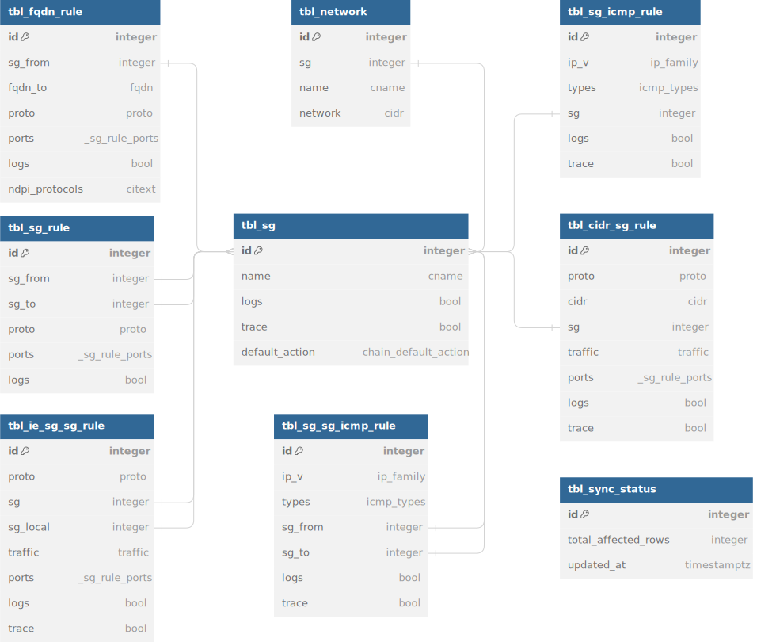

# Описание базы данных

Ниже приводится схема и описание таблиц базы данных, созданных для стандартного использования HBF-Server.

HBF-Server поддерживает PostgreSQL версии …

Поскольку HBF-Server взаимодействует с этой базой данных самостоятельно, конечному пользователю не нужно беспокоиться о ее структуре и о том как хранятся данные.

## Схема базы данных

На диаграмме ниже представлен визуальный обзор базы данных HBF-Server и связей между таблицами. В приведенном ниже Обзоре Таблиц, содержатся дополнительные сведения о таблицах и столбцах базы данных.

## **Обзор таблиц (сущности)**

В этом разделе представлен обзор всех таблиц, созданных для стандартного использования HBF-Server. С последующим детальным описанием, что находится в каждой таблице.

| **Название таблицы** | **Описание** | **Соответствующие области взаимодействия интерфейса (API)** |
| --- | --- | --- |
| [tbl_network](#tbl_network)  | таблица tbl_network хранит информацию о IP Subnets c уникальным названием, CIDR и ссылкой на SG к сети которой она принадлежит | \- [отобразить список доступных сетей (Networks)](https://youtrack.wildberries.ru/articles/SWARM-A-104/API#otobrazit-spisok-dostupnyh-setej-networks) \- [Отобразить список доступных сетей (Networks) связанных с SG](https://youtrack.wildberries.ru/articles/SWARM-A-104/API#otobrazit-spisok-dostupnyh-setej-networks-svyazannyh-s-sg) \- [Отобразить SG по IP или CIDR](https://youtrack.wildberries.ru/articles/SWARM-A-104/API#otobrazit-sg-po-ip-ili-cidr) \- [Внести изменения в БД](https://youtrack.wildberries.ru/articles/SWARM-A-104/API#vnesti-izmeneniya-v-bd) |
| [tbl_sg](#tbl_sg)  | таблица tbl_sg хранит информацию о Security Groups (SG) с уникальным названием, правилом применяемым для входящих или исходящих пакетов, также возможностью включить логирование | \- [отобразить список Security Groups (SG)](https://youtrack.wildberries.ru/articles/SWARM-A-104/API#otobrazit-spisok-security-group-sg) \- [Внести изменения в БД](https://youtrack.wildberries.ru/articles/SWARM-A-104/API#vnesti-izmeneniya-v-bd) |
| [tbl_ie_sg_sg_rule](#tbl_ie_sg_sg_rule) | таблица tbl_ie_sg_sg_rule хранит информацию SG-SG правил для входящего и исходящего траффика с сетевым транспортным протоколами и диапазоном портов | \- [отобразить список IE-SG-SG правил для входящего и исходящего траффика](https://youtrack.wildberries.ru/articles/SWARM-A-104/API#otobrazit-spisok-ie-sg-sg-pravil-dlya-vhodyashego-i-ishodyashego-traffika) \- [Внести изменения в БД](https://youtrack.wildberries.ru/articles/SWARM-A-104/API#vnesti-izmeneniya-v-bd) |
| [tbl_cidr_sg_rule](#tbl_cidr_sg_rule) | таблица tbl_cidr_sg_rule хранит информацию CIDR-SG правил для входящего и исходящего траффика с сетевым транспортным протоколом, бесклассовой междоменной маршрутизацией (CIDR) и диапазоном портов | \- [отобразить список CIRD-SG правил для входящего и исходящего траффика](https://youtrack.wildberries.ru/articles/SWARM-A-104/API#otobrazit-spisok-cidr-sg-pravil-dlya-vhodyashego-i-ishodyashego-traffika) \- [Внести изменения в БД](https://youtrack.wildberries.ru/articles/SWARM-A-104/API#vnesti-izmeneniya-v-bd) |
| [tbl_fqdn_rule](#tbl_fqdn_rule)  | таблица tbl_fqdn_rule хранит информацию SG-to-FQDN правил с сетевым транспортным протоколом и диапазоном портов | \- [отобразить список полных доменных имен (FQDN)](https://youtrack.wildberries.ru/articles/SWARM-A-104/API#otobrazit-spisok-polnyh-domennyh-imen-fqdn) \- [Внести изменения в БД](https://youtrack.wildberries.ru/articles/SWARM-A-104/API#vnesti-izmeneniya-v-bd) |
| [tbl_sg_icmp_rule](#tbl_sg_icmp_rule)  | таблица tbl_sg_icmp_rule хранит информацию SG:ICMP правил  | \- [Отобразить список правил SG:ICMP ограниченных по типу SG](https://youtrack.wildberries.ru/articles/SWARM-A-104/API#otobrazit-spisok-pravil-sgicmp-ogranichennyh-po-tipu-sg) \- [Внести изменения в БД](https://youtrack.wildberries.ru/articles/SWARM-A-104/API#vnesti-izmeneniya-v-bd) |
| [tbl_sg_rule](#tbl_sg_rule)  | таблица tbl_sg_rules хранит информацию о правилах виртуального файрволла который можно настраивать для того чтобы контролировать входящий и выходящий трафик | \- [отобразить список SG правил ограниченных по условиям from -\> to](https://youtrack.wildberries.ru/articles/SWARM-A-104/API#otobrazit-spisok-pravil-sg-ogranichennyh-po-usloviyam-from-to) \- [Внести изменения в БД](https://youtrack.wildberries.ru/articles/SWARM-A-104/API#vnesti-izmeneniya-v-bd) |
| [tbl_sg_sg_icmp_rule](#tbl_sg_sg_icmp_rule)  | таблица tbl_sg_sg_icmp_rule хранит информацию SG-SG:ICMP правил  | \- [Отобразить список правил SG-SG:ICMP ограниченных по типу SG from-\>to](https://youtrack.wildberries.ru/articles/SWARM-A-104/API#otobrazit-spisok-pravil-sg-sgicmp-ogranichennyh-po-tipu-sg-from-to) \- [Внести изменения в БД](https://youtrack.wildberries.ru/articles/SWARM-A-104/API#vnesti-izmeneniya-v-bd) |
| [tbl_sync_status](#tbl_sync_status)  | в таблице tbl_sync_status хранится информация об изменениях внесенных пользователем (дата последнего успешного изменения и кол-во изменённых строк)  | \- [Отобразить статус последнего успешного обновления БД](https://youtrack.wildberries.ru/articles/SWARM-A-104/API#otobrazit-status-poslednego-uspeshnogo-obnovleniya-bd) \- [Внести изменения в БД](https://youtrack.wildberries.ru/articles/SWARM-A-104/API#vnesti-izmeneniya-v-bd) |

## **Подробное описание таблиц**

Ниже приведены конкретные поля в каждой из таблиц, созданных для стандартного использования HBF-Server

### tbl_network

| Поле | Тип | Null | Ключ | По умолчанию | Дополнительно |
| --- | --- | --- | --- | --- | --- |
| id | int(8) |   | PRI |   | auto_increment |
| sg | int(8) | YES | FK  |   | внешний ключ к таблице tbl_sg.id  |
| name | cname |   | ALT  |   | \- длина значения не должна превышать 256 символов \- значения должно начинаться и заканчиваться символами без пробелов \- значение должно быть уникальным |
| network | cidr |   |   |   | \- значение от 7 до 19 байт пример "192.168.100.128/25" \- сетевые интервалы не должны пересекаться |

Ключи
| Имя ключа | Тип | Поля |
| --- | --- | --- |
| Alternative key | Simple Key | cname |

### tbl_sg

| Поле | Тип | Null | Ключ | По умолчанию | Дополнительно |
| --- | --- | --- | --- | --- | --- |
| id | int(8) |   | PRI |   | auto_increment |
| name | cname |   | ALT  |   | \- длина значения не должна превышать 256 символов \- значения должно начинаться и заканчиваться символами без пробелов \- значение должно быть уникальным  |
| logs | bool |   |   | false |   |
| trace | bool |   |   | false |   |
| default_action | chain_default_action |   |   | ‘DROP’::chain_default_action | одно из двух значений "DROP" или "ACCEPT"  |

Ключи

| Имя ключа | Тип | Поля |
| --- | --- | --- |
| Alternative key | Simple Key | cname |

### tbl_ie_sg_sg_rule

| Поле | Тип | Null | Ключ | По умолчанию | Дополнительно |
| --- | --- | --- | --- | --- | --- |
| id | int(8) |   | PRI |   | auto_increment |
| proto | proto |   | ALT  |   | одно из двух значений "tcp" или "udp"  |
| sg | int(8) |   | FK/ALT |   | внешний ключ к таблице tbl_sg.id |
| sg_local | int(8) |   | FK/ALT  |   | внешний ключ к таблице tbl_sg.id  |
| traffic | traffic |  | ALT |   | одно из двух значений "ingress" или "egress" |
| ports | _sg_rule_ports | YES |  |  | \- должно быть указано значение порта исходящего либо входящего трафика \- значение должно находиться в интервале от 1 до 65535 \- интервалы введённых значений портов для исходящего трафика не должны пересекаться |
| logs | bool |   |   |  |   |
| trace | bool |  |  |  |  |

Ключи

| Имя ключа | Тип | Поля |
| --- | --- | --- |
| Alternative key | Compound Key | proto, sg, sg_local, traffic |

### tbl_cidr_sg_rule

| Поле | Тип | Null | Ключ | По умолчанию | Дополнительно |
| --- | --- | --- | --- | --- | --- |
| id | int(8) |   | PRI |   | auto_increment |
| proto | proto |   | ALT  |   | одно из двух значений "tcp" или "udp"  |
| cidr | cidr |   | ALT |   | \- значение cidr (диапазон ip адресов) в рамках одного правила (proto, sg, traffic) не должны пересекаться |
| sg | int(8) |   | FK/ALT  |   | внешний ключ к таблице tbl_sg.id  |
| traffic | traffic |  | ALT |   | одно из двух значений "ingress" или "egress" |
| ports | _sg_rule_ports | YES |  |  | \- должно быть указано значение порта исходящего либо входящего трафика \- значение должно находиться в интервале от 1 до 65535 \- интервалы введённых значений портов для исходящего трафика не должны пересекаться |
| logs | bool |   |   |  |   |
| trace | bool |  |  |  |  |

Ключи

| Имя ключа | Тип | Поля |
| --- | --- | --- |
| Alternative key | Compound Key | proto, cidr, sg, traffic |

### tbl_fqdn_rule

| Поле | Тип | Null | Ключ | По умолчанию | Дополнительно |
| --- | --- | --- | --- | --- | --- |
| id | int(8) |   | PRI |   | auto_increment |
| sg_from | int(8) |   | FK/ALT  |   | внешний ключ к таблице tbl_sg.id  |
| fqdn_to | fqdn |   | ALT |   | \- длина значения не должна превышать 256 символов \- значение начинается со строки, которая содержит один или более символов, являющихся буквами нижнего регистра, цифрами, символом '**'** или символам**и '_'** и **'-'** (кроме первого символа, который не может быть '-' или '_'), и должна быть длиной от 1 до 62 символов. затем может следовать любое количество строк, начинающихся с символа '.', за которым идет один символ, являющийся буквой нижнего регистра, цифрой, символом '' или символом '-', и длина строки от 0 до 62 символов. (пример: google.com) |
| proto | proto |   | ALT  |   | одно из двух значений "tcp" или "udp"  |
| ports | _sg_rule_ports | YES |   |   | \- должно быть указано значение порта исходящего либо входящего трафика \- значение должно находиться в интервале от 1 до 65535 \- интервалы введённых значений портов для исходящего трафика не должны пересекаться |
| logs | bool |   |   | false |   |
| ndpi_protocols | citext |  |  |  | \- количество элементов в массиве (наименований протоколов) не должно превышать 255 \- значение элемента (наименование протокола) не должно начинаться или заканчиваться пробелом и не должно быть пустым |

Ключи

| Имя ключа | Тип | Поля |
| --- | --- | --- |
| Alternative key | Compound Key | sg_from, fqdn_to, proto |

### tbl_sg_icmp_rule

| Поле | Тип | Null | Ключ | По умолчанию | Дополнительно |
| --- | --- | --- | --- | --- | --- |
| id | int(8) |   | PRI |   | auto_increment |
| ip_v | ip_family |   | ALT  |   | одно из двух значений "IPv6" или "IPv4"  |
| types | icmp_types |   |   |   | массив из smallint[] кодов типа ICMP  |
| sg | int(8) |   | FK/ALT  |   | внешний ключ к таблице tbl_sg.id  |
| logs | bool |   |   |   |   |
| trace | bool |   |   |   |   |

Ключи

| Имя ключа | Тип | Поля |
| --- | --- | --- |
| Alternative key | Compound Key | ip_v, sg |

### tbl_sg_rule

| Поле | Тип | Null | Ключ | По умолчанию | Дополнительно |
| --- | --- | --- | --- | --- | --- |
| id | int(8) |   | PRI |   | auto_increment |
| sg_from | int(8) |   | FK/ALT  |   | внешний ключ к таблице tbl_sg.id  |
| sg_to | int(8) |   | FK/ALT  |   | внешний ключ к таблице tbl_sg.id  |
| proto | proto |   | ALT  |   | одно из двух значений "tcp" или "udp"  |
| ports | _sg_rule_ports | YES |   |   | \- должно быть указано значение порта исходящего либо входящего трафика \- значение должно находиться в интервале от 1 до 65535 \- интервалы введённых значений портов для исходящего трафика не должны пересекаться |
| logs | bool |   |   | false |   |

Ключи

| Имя ключа | Тип | Поля |
| --- | --- | --- |
| Alternative key | Compound Key | sg_from, sg_to, proto |

### tbl_sg_sg_icmp_rule

| Поле | Тип | Null | Ключ | По умолчанию | Дополнительно |
| --- | --- | --- | --- | --- | --- |
| id | int(8) |   | PRI |   | auto_increment |
| ip_v | ip_family |   | ALT  |   | одно из двух значений "IPv6" или "IPv4"  |
| types | icmp_types |   |   |   | массив из smallint[] кодов типа ICMP  |
| sg_from | int(8) |   | FK/ALT  |   | внешний ключ к таблице tbl_sg.id  |
| sg_to | int(8) |   | FK/ALT  |   | внешний ключ к таблице tbl_sg.id  |
| logs | bool |   |   |   |   |
| trace | bool |   |   |   |   |

Ключи

| Имя ключа | Тип | Поля |
| --- | --- | --- |
| Alternative key | Compound Key | ip_v, sg_from, sg_to |

### tbl_sync_status

| Поле | Тип | Null | Ключ | По умолчанию | Дополнительно |
| --- | --- | --- | --- | --- | --- |
| id | int(8) |   | PRI |   | auto_increment |
| total_affected_rows | int(8) |   |   |   | при любой процедуре (удаление/добавление/редактирование) данных в таблицах, tbl_network, tbl_sg, tbl_fqdn_rule, tbl_sg_rule, tbl_sg_icmp_rule, tbl_sg_sg_icmp_rule, будет учтена сумма всех изменённых строк  |
| updated_at | timstamptz | YES |   |   | дата изменения  |

