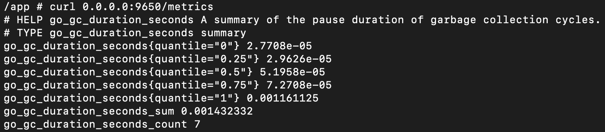

# Мониторинг

Информация о состоянии агента на различных узлах основывается по метрикам из [данной панели Grafana](https://grafana.wildberries.ru/d/fc958a44-ddb5-494e-9260-b3cc53a04ed9/hbf-server?orgId=1&from=now-6h&to=now). На ней также настроены уведомления, связанные с недоступностью или некорректной работой агента. Уведомления приходят в закрытый канал в Rocket.chat (#HBF_ALERTS). Таблица ниже описывает возможные для агента уведомления и причины их возникновения.

| Уведомление | Причина уведомления |
| --- | --- |
| Статус health-check равен 0 | Метрика `healthcheck` возвращает значение 0 или по данной метрике отсутствуют значения |
| Сервер перестал отдавать логи. | Выполнение запроса `source=.ds-logstash-datastream-k8s-swarm AND data_stream.namespace:"swarm" AND kubernetes.cluster:"k8s.prod-dl" AND kubernetes.container_name:"sgrouops"` отдает значение ниже 1. Иными словами сервер перестал что-либо писать в stdout. |

## **Метрики**

Метрики по умолчанию доступны через порт **9650**. Для активации метрик следует установить параметр "metrics.enable" в конфигурационном файле в значение `true` ( по умолчанию файл конфигурации находится в */opt/swarm/etc/sgroups/config.yaml* ). Для проверки доступности метрик рекомендуется выполнить команду `curl 0.0.0.0:9650/metrics`.

**Описание метрик**

Зеленым цветом выделены ключевые метрики.

| Metric Name | Metric Type | Description |
| --- | --- | --- |
| go_gc_duration_seconds | summary | Сводка длительности пауз циклов сборки мусора |
| go_gc_duration_seconds_count | counter | Сводка длительности пауз циклов сборки мусора |
| go_goroutines | gauge | Количество текущих горутин |
| go_info | gauge | Информация о среде выполнения |
| go_memstats_alloc_bytes | gauge | Количество выделенных и все еще используемых байтов |
| go_memstats_alloc_bytes_total | counter | Общее количество выделенных байтов, даже если они были освобождены |
| go_memstats_buck_hash_sys_bytes | gauge | Количество байтов, используемых хэш-таблицей профилирования |
| go_memstats_frees_total | counter | Общее количество "освобожденных" объектов кучи |
| go_memstats_gc_sys_bytes | gauge | Количество байтов, используемых для метаданных системы сборки мусора |
| go_memstats_heap_alloc_bytes | gauge | Количество выделенных и все еще используемых байтов кучи |
| go_memstats_heap_idle_bytes | gauge | Количество байтов кучи в ожидании использования |
| go_memstats_heap_inuse_bytes | gauge | Количество байтов кучи, используемых в данный момент |
| go_memstats_heap_objects | gauge | Количество выделенных объектов |
| go_memstats_heap_released_bytes | gauge | Количество байтов кучи, освобожденных в ОС |
| go_memstats_heap_sys_bytes | gauge | Количество байтов кучи, полученных от системы |
| go_memstats_last_gc_time_seconds | gauge | Количество секунд с 1970 года последней сборки мусора |
| go_memstats_lookups_total | counter | Общее количество поисков указателей |
| go_memstats_mallocs_total | counter | Общее количество выделений памяти |
| go_memstats_mcache_inuse_bytes | gauge | Количество байтов, используемых структурами mcache |
| go_memstats_mcache_sys_bytes | gauge | Количество байтов, используемых структурами mcache, полученных из системы |
| go_memstats_mspan_inuse_bytes | gauge | Количество байтов, используемых структурами mspan |
| go_memstats_mspan_sys_bytes | gauge | Количество байтов, используемых структурами mspan, полученных из системы |
| go_memstats_next_gc_bytes | gauge | Количество байтов кучи при следующей сборке мусора |
| go_memstats_other_sys_bytes | gauge | Количество байтов, используемых для других системных выделений |
| go_memstats_stack_inuse_bytes | gauge | Количество байтов, используемых выделителем стека |
| go_memstats_stack_sys_bytes | gauge | Количество байтов, полученных от системы для выделителя стека |
| go_memstats_sys_bytes | gauge | Количество байтов, полученных от системы |
| go_threads | gauge | Количество созданных ОС потоков |
| healthcheck | gauge | Индикатор проверки состояния процесса (0 или 1) |
| process_cpu_seconds_total | counter | Общее количество времени CPU пользователя и системы в секундах |
| process_max_fds | gauge | Максимальное количество открытых дескрипторов файлов |
| process_open_fds | gauge | Количество открытых дескрипторов файлов |
| process_resident_memory_bytes | gauge | Размер резидентной памяти в байтах |
| process_start_time_seconds | gauge | Время запуска процесса с начала эпохи Unix в секундах |
| process_virtual_memory_bytes | gauge | Размер виртуальной памяти в байтах |
| process_virtual_memory_max_bytes | gauge | Максимальный объем доступной виртуальной памяти в байтах |
| promhttp_metric_handler_requests_in_flight | counter | Общее количество выявленных запросов по коду состояния HTTP |
| server_grpc_connections | gauge | Количество подключенных на данный момент агентов |