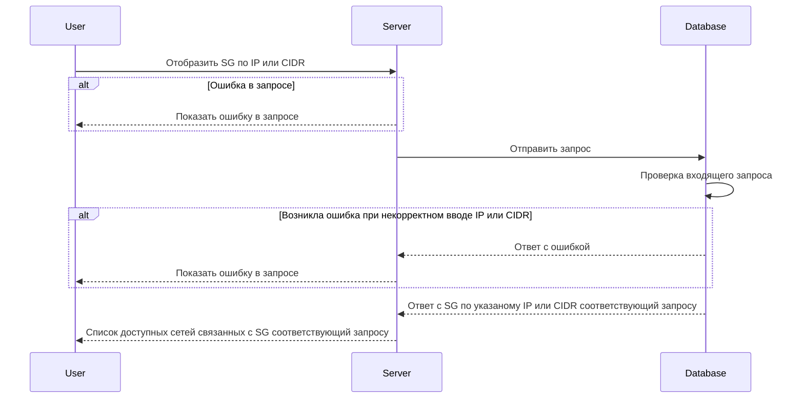

# GET /v1/\{address\}/sg

## **Запрос**

`GET /v1/{address}/sg`

## **Ответ**

```json
{
  "logs": false,
  "name": "sg-4",
  "trace": false,
  "networks": ["nw-5"],
  "defaultAction": "DROP"
}
```

## **Входные параметры**

<table>
    <thead>
        <tr>
            <th>№</th>
            <th>Параметр</th>
            <th>Тип данных</th>
            <th>Обязательность</th>
            <th>Описание</th>
            <th>Варианты значений</th>
        </tr>
    </thead>
    <tbody>
        <tr>
            <td>1</td>
            <td>\{address\}</td>
            <td>string</td>
            <td>да</td>
            <td>IP или CIDR</td>
            <td>10.150.0.224/32</td>
        </tr>
    </tbody>
</table>

## **Проверки**

<table>
    <thead>
        <tr>
            <th>Параметр</th>
            <th>Условие</th>
        </tr>
    </thead>
    <tbody>
        <tr>
            <td>\{address\}</td>
            <td>- необходимо указать значение в формате IP (10.150.0.224)</td>
        </tr>
    </tbody>
</table>

## **Выходные параметры**

### **Положительный ответ**

<table>
    <thead>
        <tr>
            <th>№</th>
            <th>Параметр</th>
            <th>Тип данных</th>
            <th>Описание</th>
            <th>Варианты значений</th>
        </tr>
    </thead>
    <tbody>
        <tr>
            <td>1</td>
            <td>logs</td>
            <td>bool</td>
            <td>включено или выключено логирование (по умолчанию выключено)</td>
            <td>true/false</td>
        </tr>
        <tr>
            <td>1.1</td>
            <td>name</td>
            <td>string</td>
            <td>уникальное имя security group</td>
            <td>sg-0</td>
        </tr>
        <tr>
            <td>1.2</td>
            <td>trace</td>
            <td>bool</td>
            <td>включена или выключена трассировка(по умолчанию выключена)</td>
            <td>true/false</td>
        </tr>
        <tr>
            <td>1.3</td>
            <td>networks</td>
            <td>array of strings</td>
            <td>массив уникальных имен сети</td>
            <td>&quot;nw-0&quot;, &quot;nw-1&quot;</td>
        </tr>
        <tr>
            <td>1.4</td>
            <td>defaultAction</td>
            <td>string</td>
            <td></td>
            <td>&quot;DROP&quot;/&quot;ACCEPT&quot;</td>
        </tr>
    </tbody>
</table>

### **Ответ с ошибками**

Код ошибки 400

- Указано значение не является ни IP ни CIDR

```json
{
  "code": 3,
  "details": [],
  "message": "invalid request: no address is provided"
}
```

- Указано значение в формате CIDR (10.10.0.8/30)

```json
{
  "code": 5,
  "details": [],
  "message": "Not Found"
}
```

Код ошибки 400

- Ошибка в запросе

```json
{
  "code": 5,
  "details": [],
  "message": "Not Found"
}
```

## **Описание интеграции**


