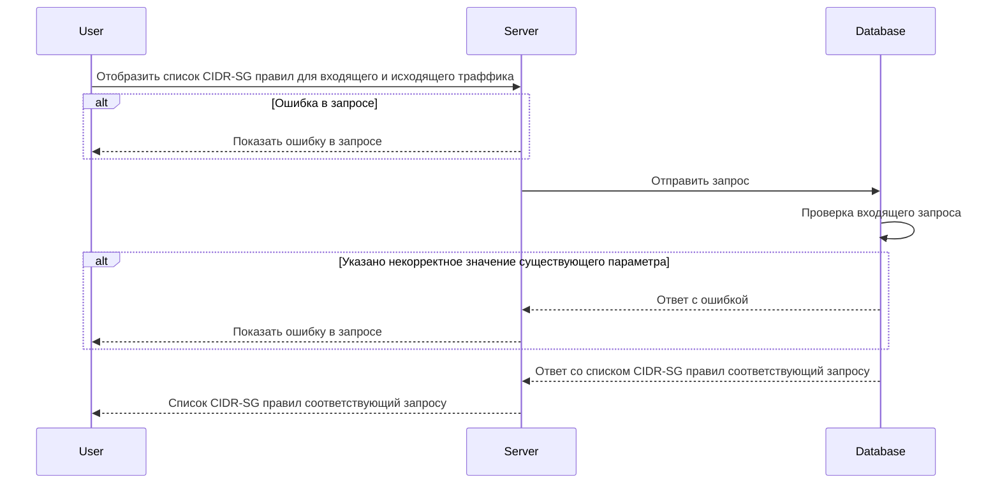

# POST /v1/cidr-sg/rules

## **Запрос**

`POST /v1/cidr-sg/rules`

<ul>
    <li>если в теле запроса указать одно или более sg - значений из имён источников Security Groups (sg), то получим ответ по указанным cidr-sg правилам</li>
    <li>если в теле запроса указать пустой массив sg, то получим ответ со всеми существующими cidr-sg правилами</li>
    <li>если указано некорректное тело в запросе, то получим ответ со всеми существующими cidr-sg правилами</li>
</ul>

```json
{
  "sg": ["sg-0"]
}
```

## **Ответ**

```json
{
  "rules": [
    {
      "CIDR": "10.10.0.8/30",
      "SG": "sg-0",
      "logs": true,
      "ports": [
        {
          "d": "7800",
          "s": "4446"
        }
      ],
      "trace": true,
      "traffic": "Ingress",
      "transport": "TCP"
    }
  ]
}
```

## **Входные параметры**

<table>
    <thead>
        <tr>
            <th>№</th>
            <th>Параметр</th>
            <th>Тип данных</th>
            <th>Обязательность</th>
            <th>Описание</th>
            <th>Варианты значений</th>
        </tr>
    </thead>
    <tbody>
        <tr>
            <td>1</td>
            <td>sg</td>
            <td>array of strings</td>
            <td>да</td>
            <td>массив из имен источников SG</td>
            <td>sg-11</td>
        </tr>
    </tbody>
</table>

## **Проверки**

<table>
    <thead>
        <tr>
            <th>Параметр</th>
            <th>Условие</th>
        </tr>
    </thead>
    <tbody>
        <tr>
            <td>sg</td>
            <td>\- длина значения не должна превышать 256 символов&lt;br /&gt;\- значение должно начинаться и заканчиваться символами без пробелов</td>
        </tr>
    </tbody>
</table>

## **Выходные параметры**

### **Положительный ответ**

<table>
    <thead>
        <tr>
            <th>№</th>
            <th>Параметр</th>
            <th>Тип данных</th>
            <th>Описание</th>
            <th>Варианты значений</th>
        </tr>
    </thead>
    <tbody>
        <tr>
            <td>1</td>
            <td>rules</td>
            <td>array of objects</td>
            <td></td>
            <td>-</td>
        </tr>
        <tr>
            <td>1.1</td>
            <td>rules[].CIDR</td>
            <td>string</td>
            <td></td>
            <td>10.10.0.8/30</td>
        </tr>
        <tr>
            <td>1.2</td>
            <td>rules[].sg</td>
            <td>string</td>
            <td>название Security group</td>
            <td>sg-0</td>
        </tr>
        <tr>
            <td>1.3</td>
            <td>rules[].logs</td>
            <td>bool</td>
            <td>включено или выключено логирование (по умолчанию выключено)</td>
            <td>true/false</td>
        </tr>
        <tr>
            <td>1.4</td>
            <td>rules[].ports</td>
            <td>array of objects</td>
            <td></td>
            <td>\-</td>
        </tr>
        <tr>
            <td>1.4.1</td>
            <td>rules[].ports[].d</td>
            <td>string</td>
            <td>значения портов входящего трафика</td>
            <td>&quot;7600-7700,7800&quot;</td>
        </tr>
        <tr>
            <td>1.4.2</td>
            <td>rules[].ports[].s</td>
            <td>string</td>
            <td>значения портов исходящего трафика</td>
            <td>&quot;4446&quot;</td>
        </tr>
        <tr>
            <td>1.5</td>
            <td>rules[].sgFrom</td>
            <td>string</td>
            <td>название Security group</td>
            <td>sg-0</td>
        </tr>
        <tr>
            <td>1.6</td>
            <td>rules[].trace</td>
            <td>bool</td>
            <td>включена или выключена трассировка (по умолчанию выключена)</td>
            <td>true/false</td>
        </tr>
        <tr>
            <td>1.7</td>
            <td>rules[].traffic</td>
            <td>string</td>
            <td>тип траффика (входящий/исходящий)</td>
            <td>&quot;Undef&quot;/&quot;Ingress&quot;/&quot;Egress&quot;</td>
        </tr>
        <tr>
            <td>1.5</td>
            <td>rules[].transport</td>
            <td>string</td>
            <td>метод передачи данных</td>
            <td>&quot;TCP&quot;/&quot;UDP&quot;</td>
        </tr>
    </tbody>
</table>

### **Ответ с ошибками**

Код ошибки 400

- Указано некорректное значение существующего параметра

```json
{
  "code": 3,
  "details": [],
  "message": "proto: syntax error (line __): unexpected token \"string\""
}
```

Код ошибки 404

- Ошибка в запросе

```json
{
  "code": 5,
  "details": [],
  "message": "Not Found"
}
```

## **Описание интеграции**


