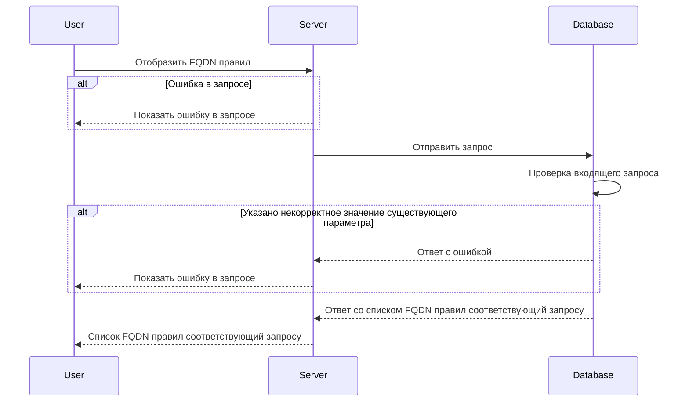

import { FancyboxDiagram } from '@site/src/components/commonBlocks/FancyboxDiagram'
import { RESPOND_CODES } from '@site/src/constants/errorCodes.tsx'
import Codes from '@site/src/components/commonBlocks/Codes/_Codes.mdx'

# POST /v1/fqdn/rules

## **Запрос**

`POST /v1/fqdn/rules`

<ul>
  <li>
    если в теле запроса указать одно или более sgFrom - значений из имён источников Security Groups (sg), то получим
    ответ по указанным fqdn правилам
  </li>
  <li>если в теле запроса указать пустой массив sgFrom, то получим ответ со всеми существующими fqdn правилами</li>
  <li>если указано некорректное тело в запросе, то получим ответ со всеми существующими fqdn правилами</li>
</ul>

```json
{
  "sgFrom": ["sg-0"]
}
```

## **Ответ**

```json
{
  "rules": [
    {
      "FQDN": "google.com",
      "logs": true,
      "ports": [
        {
          "d": "7600-7700,7800",
          "s": "4446"
        }
      ],
      "sgFrom": "sg-0",
      "transport": "TCP",
      "protocols": ["http", "ssh"]
    }
  ]
}
```

## **Входные параметры**

<div className="scrollable-x">
  <table>
    <thead>
      <tr>
        <th>№</th>
        <th>Параметр</th>
        <th>Тип данных</th>
        <th>Обязательность</th>
        <th>Описание</th>
        <th>Варианты значений</th>
      </tr>
    </thead>
    <tbody>
      <tr>
        <td>1</td>
        <td>sgFrom</td>
        <td>array of strings</td>
        <td>да</td>
        <td>массив из имен источников SG</td>
        <td>sg-11</td>
      </tr>
    </tbody>
  </table>
</div>

## **Проверки**

<div className="scrollable-x">
  <table>
    <thead>
      <tr>
        <th>Параметр</th>
        <th>Условие</th>
      </tr>
    </thead>
    <tbody>
      <tr>
        <td>sgFrom</td>
        <td>
          \- длина значения не должна превышать 256 символов
          <br />
          \- значение должно начинаться и заканчиваться символами без пробелов
        </td>
      </tr>
    </tbody>
  </table>
</div>

## **Выходные параметры**

### **Положительный ответ**

<div className="scrollable-x">
  <table>
    <thead>
      <tr>
        <th>№</th>
        <th>Параметр</th>
        <th>Тип данных</th>
        <th>Описание</th>
        <th>Варианты значений</th>
      </tr>
    </thead>
    <tbody>
      <tr>
        <td>1</td>
        <td>rules</td>
        <td>array of objects</td>
        <td></td>
        <td>\-</td>
      </tr>
      <tr>
        <td>1.1</td>
        <td>rules[].FQDN</td>
        <td>string</td>
        <td>полное доменное имя</td>
        <td>google.com</td>
      </tr>
      <tr>
        <td>1.2</td>
        <td>rules[].logs</td>
        <td>bool</td>
        <td>включено или выключено логирование (по умолчанию выключено)</td>
        <td>true/false</td>
      </tr>
      <tr>
        <td>1.3</td>
        <td>rules[].ports</td>
        <td>array of objects</td>
        <td></td>
        <td>\-</td>
      </tr>
      <tr>
        <td>1.3.1</td>
        <td>rules[].ports[].d</td>
        <td>string</td>
        <td>значения портов входящего трафика</td>
        <td>&quot;7600-7700,7800&quot;</td>
      </tr>
      <tr>
        <td>1.3.2</td>
        <td>rules[].ports[].s</td>
        <td>string</td>
        <td>значения портов исходящего трафика</td>
        <td>&quot;4446&quot;</td>
      </tr>
      <tr>
        <td>1.4</td>
        <td>rules[].sgFrom</td>
        <td>string</td>
        <td>название Security group</td>
        <td>sg-0</td>
      </tr>
      <tr>
        <td>1.5</td>
        <td>rules[].transport</td>
        <td>string</td>
        <td>метод передачи данных</td>
        <td>&quot;TCP&quot;/&quot;UDP&quot;</td>
      </tr>
      <tr>
        <td>1.6</td>
        <td>rules[].protocols[]</td>
        <td>array of strings</td>
        <td>значения протоколов</td>
        <td>&quot;http&quot;, &quot;ssh&quot;</td>
      </tr>
    </tbody>
  </table>
</div>

### **Ответ с ошибками**

<Codes data = {RESPOND_CODES.internal} />
<Codes data = {RESPOND_CODES.not_found} />

## **Описание интеграции**

<FancyboxDiagram>



</FancyboxDiagram>
