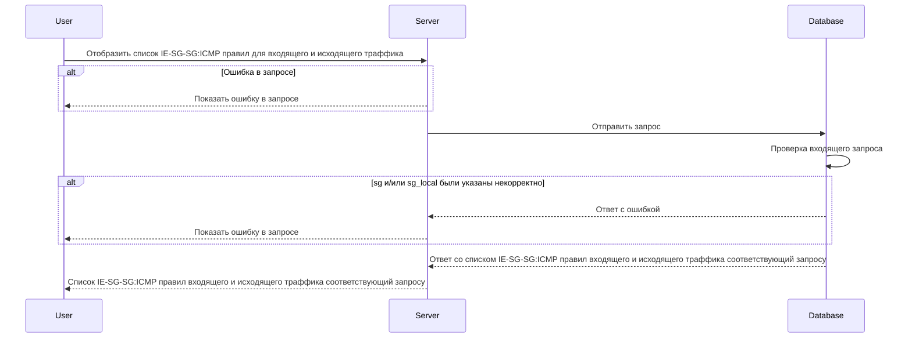

import { RName } from "../../../../restrictions.mdx";

# POST v1/ie-sg-sg-icmp/rules

## Запрос

`POST v1/ie-sg-sg-icmp/rules`

<ul>
  <li class="text-justify">
    если в теле запроса указано одно или более значений в обоих массивах sg ->
    sg_local, то получим ответ всех существующих комбинаций правил IE-SG-SG-ICMP
    каждого указанного значения sg с каждым указанным значением sg_local
    (value-to-value)
  </li>
  <li class="text-justify">
    если в теле запроса один из массивов пустой а во втором указаны от одного и
    более значений, то получим ответ всех существующих комбинаций правил
    IE-SG-SG-ICMP каждого указанного значения со всеми существующими
    (any-to-value, value-to-any)
  </li>
  <li class="text-justify">
    если в теле запроса указаны пустые массивы sg -> sg_local, то получим ответ
    всех существующих комбинаций правил IE-SG-SG-ICMP (any-to-any)
  </li>
  <li class="text-justify">
    если указано некорректное тело в запросе, то получим ответ всех существующих
    комбинаций правил IE-SG-SG-ICMP (any-to-any)
  </li>
</ul>

```json
{
  "sg": ["sg-1"],
  "sg_local": ["sg-2"]
}
```

## Ответ

```json
{
  "rules": [
    {
      "sg": "sg-1",
      "sg_local": "sg-2",
      "logs": true,
      "trace": true,
      "traffic": "Ingress",
      "ICMP": {
        "IPv": "IPv4",
        "Types": [0, 8]
      }
    }
  ]
}
```

## Входные параметры

<table>
  <thead>
    <tr>
      <th>№</th>
      <th>Параметр</th>
      <th>Тип данных</th>
      <th>Обязательность</th>
      <th>Описание</th>
      <th>Варианты значений</th>
    </tr>
  </thead>
  <tbody>
    <tr>
      <td>1</td>
      <td>sg</td>
      <td>String[]</td>
      <td>да</td>
      <td>массив из имен источников SG</td>
      <td>SG-11</td>
    </tr>
    <tr>
      <td>2</td>
      <td>sg_local</td>
      <td>String[]</td>
      <td>да</td>
      <td>массив из имен источников SG</td>
      <td>SG-22</td>
    </tr>
  </tbody>
</table>

## Проверки

<table>
  <thead>
    <tr>
      <th>Параметр</th>
      <th>Условие</th>
    </tr>
  </thead>
  <tbody>
    <tr>
      <td>sg</td>
      <td>
        <RName />
      </td>
    </tr>
    <tr>
      <td>sg_local</td>
      <td>
        <RName />
      </td>
    </tr>
  </tbody>
</table>

## Выходные параметры

### Положительный ответ

<table>
  <thead>
    <tr>
      <th>№</th>
      <th>Параметр</th>
      <th>Тип данных</th>
      <th>Описание</th>
      <th>Варианты значений</th>
    </tr>
  </thead>
  <tbody>
    <tr>
      <td>1</td>
      <td>rules</td>
      <td>String[]</td>
      <td></td>
      <td>-</td>
    </tr>
    <tr>
      <td>1.2</td>
      <td>rules[].sg</td>
      <td>String</td>
      <td>название Security group</td>
      <td>sg-0</td>
    </tr>
    <tr>
      <td>1.3</td>
      <td>rules[].sg_local</td>
      <td>String</td>
      <td>название Security group</td>
      <td>sg-0</td>
    </tr>
    <tr>
      <td>1.4</td>
      <td>rules[].logs</td>
      <td>Boolean</td>
      <td>включено или выключено логирование (по умолчанию выключено)</td>
      <td>true/false</td>
    </tr>
    <tr>
      <td>1.5</td>
      <td>rules[].trace</td>
      <td>Boolean</td>
      <td>включена или выключена трассировка (по умолчанию выключена)</td>
      <td>true/false</td>
    </tr>
    <tr>
      <td>1.6</td>
      <td>rules[].traffic</td>
      <td>String</td>
      <td>тип траффика (входящий/исходящий)</td>
      <td>
        <nobr>"Undef" | "Ingress" | "Egress"</nobr>
      </td>
    </tr>
    <tr>
      <td>1.7</td>
      <td>rules[].ICMP</td>
      <td>Object</td>
      <td></td>
      <td></td>
    </tr>
    <tr>
      <td>1.7.1</td>
      <td>rules[].ICMP.IPv</td>
      <td>String</td>
      <td>версия интернет-протокола</td>
      <td>"IPv4" | "IPv6"</td>
    </tr>
    <tr>
      <td>1.7.2</td>
      <td>rules[].ICMP.Types[]</td>
      <td>Integer[]</td>
      <td>код типа ICMP</td>
      <td>0, 8, 100</td>
    </tr>
  </tbody>
</table>

### Ответ с ошибками

Код ошибки 400

- Если sg или sg_local были указаны некорректно:
  \- ошибка, если значения были указаны не как массив, а как одно значение
  \- ошибка, если значение sg или sg_local не соответствует формату названия security group (длина значения не должна превышать 256 символов, значения должно начинаться и заканчиваться символами без пробелов, значение должно быть уникальным)

```json
{
  "code": 3,
  "details": [],
  "message": "proto: syntax error (line __): unexpected token \"string\""
}
```

Код ошибки 404

- Опечатка в имени метода

```json
{
  "code": 5,
  "details": [],
  "message": "Not Found"
}
```

## Описание интеграции


