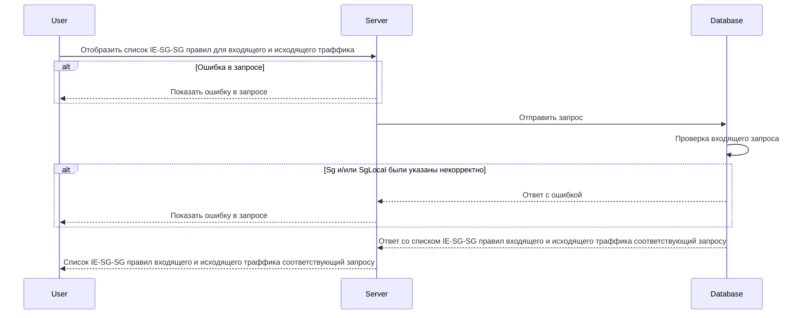

import { Restrictions } from '@site/src/components/commonBlocks/Restrictions'
import { RESTRICTIONS } from '@site/src/constants/restrictions.tsx'
import { FancyboxDiagram } from '@site/src/components/commonBlocks/FancyboxDiagram'
import { RESPOND_CODES } from '@site/src/constants/errorCodes.tsx'

# POST v1/ie-sg-sg/rules

## Запрос

`POST v1/ie-sg-sg/rules`

<ul>
  <li className="text-justify">
    если в теле запроса указано одно или более значений в обоих массивах Sg -\> SgLocal, то получим ответ всех
    существующих комбинаций правил IE-SG-SG каждого указанного значения Sg с каждым указанным значением SgLocal
    (value-to-value)
  </li>
  <li className="text-justify">
    если в теле запроса один из массивов пустой а во втором указаны от одного и более значений, то получим ответ всех
    существующих комбинаций правил IE-SG-SG каждого указанного значения со всеми существующими (any-to-value,
    value-to-any)
  </li>
  <li className="text-justify">
    если в теле запроса указаны пустые массивы Sg -\> SgLocal, то получим ответ всех существующих комбинаций правил
    IE-SG-SG (any-to-any)
  </li>
  <li className="text-justify">
    если указано некорректное тело в запросе, то получим ответ всех существующих комбинаций правил IE-SG-SG (any-to-any)
  </li>
</ul>

```json
{
  "Sg": ["sg-1"],
  "SgLocal": ["sg-2"]
}
```

## Ответ

```json
{
  "rules": [
    {
      "Sg": "sg-1",
      "SgLocal": "sg-2",
      "logs": true,
      "trace": true,
      "ports": [
        {
          "d": "7800",
          "s": "4446"
        }
      ],
      "traffic": "Ingress",
      "transport": "TCP"
    }
  ]
}
```

## Входные параметры

<div className="scrollable-x">
  <table>
    <thead>
      <tr>
        <th>№</th>
        <th>Параметр</th>
        <th>Тип данных</th>
        <th>Обязательность</th>
        <th>Описание</th>
        <th>Варианты значений</th>
      </tr>
    </thead>
    <tbody>
      <tr>
        <td>1</td>
        <td>Sg</td>
        <td>array of strings</td>
        <td>да</td>
        <td>массив из имен источников SG</td>
        <td>sg-11</td>
      </tr>
      <tr>
        <td>2</td>
        <td>SgLocal</td>
        <td>array of strings</td>
        <td>да</td>
        <td>массив из имен источников SG</td>
        <td>sg-12</td>
      </tr>
    </tbody>
  </table>
</div>

## Проверки

<div className="scrollable-x">
  <table>
    <thead>
      <tr>
        <th>Параметр</th>
        <th>Условие</th>
      </tr>
    </thead>
    <tbody>
      <tr>
        <td>Sg</td>
        <td>
          <Restrictions data={RESTRICTIONS.name} />
        </td>
      </tr>
      <tr>
        <td>SgLocal</td>
        <td>
          <Restrictions data={RESTRICTIONS.name} />
        </td>
      </tr>
    </tbody>
  </table>
</div>

## Выходные параметры

### Положительный ответ

<div className="scrollable-x">
  <table>
    <thead>
      <tr>
        <th>№</th>
        <th>Параметр</th>
        <th>Тип данных</th>
        <th>Описание</th>
        <th>Варианты значений</th>
      </tr>
    </thead>
    <tbody>
      <tr>
        <td>1</td>
        <td>rules</td>
        <td>array of objects</td>
        <td></td>
        <td>-</td>
      </tr>
      <tr>
        <td>1.2</td>
        <td>rules[].Sg</td>
        <td>string</td>
        <td>название Security group</td>
        <td>sg-0</td>
      </tr>
      <tr>
        <td>1.3</td>
        <td>rules[].SgLocal</td>
        <td>string</td>
        <td>название Security group</td>
        <td>sg-0</td>
      </tr>
      <tr>
        <td>1.4</td>
        <td>rules[].logs</td>
        <td>bool</td>
        <td>включено или выключено логирование (по умолчанию выключено)</td>
        <td>true/false</td>
      </tr>
      <tr>
        <td>1.5</td>
        <td>rules[].trace</td>
        <td>bool</td>
        <td>включена или выключена трассировка (по умолчанию выключена)</td>
        <td>true/false</td>
      </tr>
      <tr>
        <td>1.6</td>
        <td>rules[].ports</td>
        <td>array of objects</td>
        <td></td>
        <td>-</td>
      </tr>
      <tr>
        <td>1.6.1</td>
        <td>rules[].ports[].d</td>
        <td>string</td>
        <td>значения портов входящего трафика</td>
        <td>"7600-7700,7800"</td>
      </tr>
      <tr>
        <td>1.6.2</td>
        <td>rules[].ports[].s</td>
        <td>string</td>
        <td>значения портов исходящего трафика</td>
        <td>&quot;4446&quot;</td>
      </tr>
      <tr>
        <td>1.7</td>
        <td>rules[].traffic</td>
        <td>string</td>
        <td>тип траффика (входящий/исходящий)</td>
        <td>"Undef" | "Ingress" | "Egress"</td>
      </tr>
      <tr>
        <td>1.8</td>
        <td>rules[].transport</td>
        <td>string</td>
        <td>метод передачи данных</td>
        <td>"TCP" | "UDP"</td>
      </tr>
    </tbody>
  </table>
</div>

### Ответ с ошибками

{RESPOND_CODES.not_found.grpcCode}

Код ошибки 400

- Если Sg или SgLocal были указаны некорректно:
  \- ошибка, если значения были указаны не как массив, а как одно значение
  \- ошибка, если значение Sg или SgLocal не соответствует формату названия security group (длина значения не должна превышать 256 символов, значения должно начинаться и заканчиваться символами без пробелов, значение должно быть уникальным)

```json
{
  "code": 3,
  "details": [],
  "message": "proto: syntax error (line __): unexpected token \"string\""
}
```

Код ошибки 404

- Опечатка в имени метода

```json
{
  "code": 5,
  "details": [],
  "message": "Not Found"
}
```

## Описание интеграции

<FancyboxDiagram>



</FancyboxDiagram>
