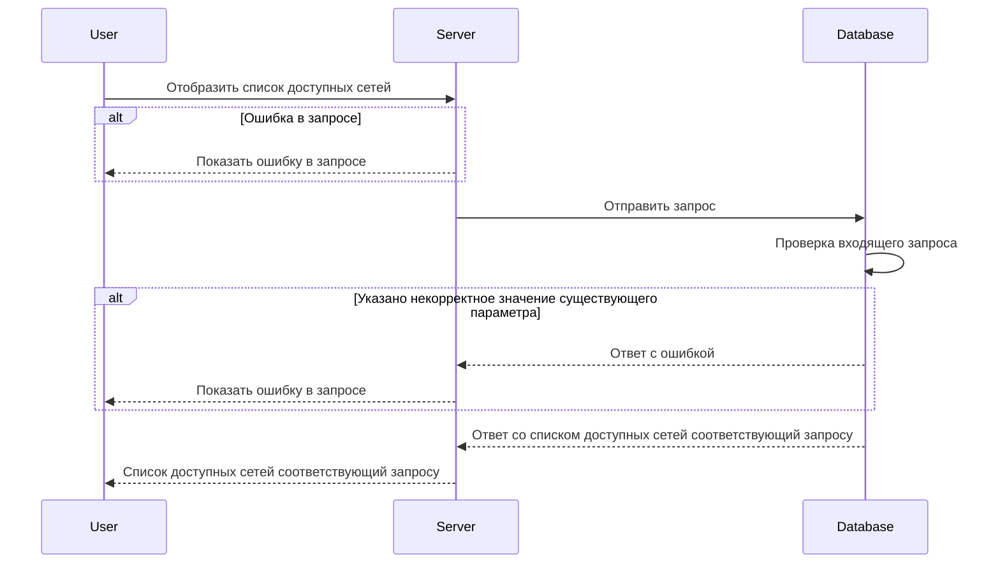

# POST /v1/list/networks

## **Запрос**

`POST /v1/list/networks`

<ul>
    <li>если в теле запроса указать одно или более neteworksNames - массив из уникальных имён сети, то получим ответ по указанным сетям</li>
    <li>если в теле запроса указать пустое тело, то получим ответ со всеми существующими сетями</li>
    <li>если указано некорректное тело в запросе, то получим ответ со всеми существующими сетями</li>
</ul>

```json
{
  "neteworkNames": ["nw-0"]
}
```

## **Ответ**

```json
{
  "networks": [
    {
      "name": "nw-0",
      "network": {
        "CIDR": "10.150.0.220/32"
      }
    }
  ]
}
```

## **Входные параметры**

<table>
    <thead>
        <tr>
            <th>№</th>
            <th>Параметр</th>
            <th>Тип данных</th>
            <th>Обязательность</th>
            <th>Описание</th>
            <th>Варианты значений</th>
        </tr>
    </thead>
    <tbody>
        <tr>
            <td>1</td>
            <td>neteworkNames</td>
            <td>array of strings</td>
            <td>да</td>
            <td>массив из уникальных имён сети</td>
            <td>nw-1</td>
        </tr>
    </tbody>
</table>

## **Проверки**

<table>
    <thead>
        <tr>
            <th>Параметр</th>
            <th>Условие</th>
        </tr>
    </thead>
    <tbody>
        <tr>
            <td>neteworkNames</td>
            <td>\- длина значения не должна превышать 256 символов&lt;br /&gt;\- значение должно начинаться и заканчиваться символами без пробелов</td>
        </tr>
    </tbody>
</table>

## **Выходные параметры**

### **Положительный ответ**

<table>
    <thead>
        <tr>
            <th>№</th>
            <th>Параметр</th>
            <th>Тип данных</th>
            <th>Описание</th>
            <th>Варианты значений</th>
        </tr>
    </thead>
    <tbody>
        <tr>
            <td>1</td>
            <td>networks</td>
            <td>array of objects</td>
            <td></td>
            <td>\-</td>
        </tr>
        <tr>
            <td>1.1</td>
            <td>networks[].names</td>
            <td>string</td>
            <td>уникальное имя сети</td>
            <td>nw-0</td>
        </tr>
        <tr>
            <td>1.2</td>
            <td>networks[].network</td>
            <td>object</td>
            <td></td>
            <td>\-</td>
        </tr>
        <tr>
            <td>1.3</td>
            <td>networks[].network.CIDR</td>
            <td>string</td>
            <td></td>
            <td>10.150.0.220/32</td>
        </tr>
    </tbody>
</table>

### **Ответ с ошибками**

Код ошибки 400

- Указано некорректное значение существующего параметра

  ```json
  {
    "code": 3,
    "details": [],
    "message": "proto: syntax error (line __): unexpected token \"string\""
  }
  ```

Код ошибки 404

- Ошибка в запросе

```json
{
  "code": 5,
  "details": [],
  "message": "Not Found"
}
```

## **Описание интеграции**


