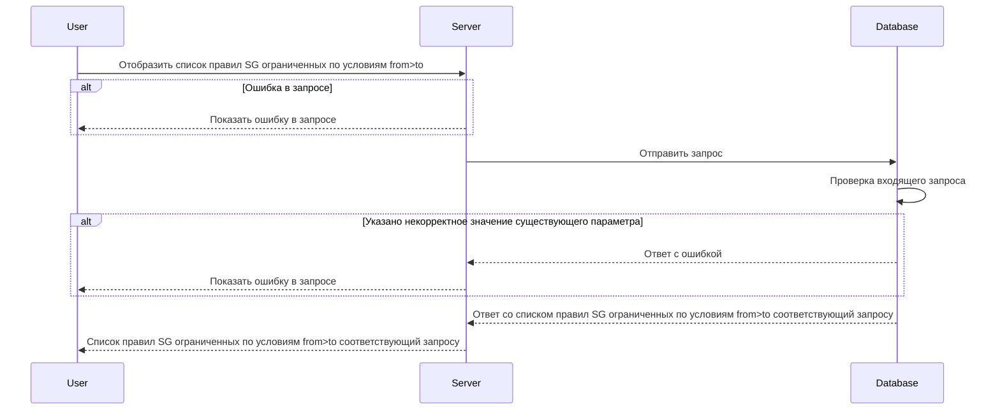

# POST /v1/rules

## **Запрос**

`POST /v1/rules`

<ul>
  <li class="text-justify">если в теле запроса указано одно или более значений в обоих массивах sgFrom -\> sgTo, то получим ответ всех существующих комбинаций каждого указанного значения sgFrom с каждым указанным значением sgTo (value-to-value)</li>
  <li class="text-justify">если в теле запроса один из массивов пустой а во втором указаны от одного и более значений, то получим ответ всех существующих комбинаций каждого указанного значения со всеми существующими (any-to-value, value-to-any)</li>
  <li>если в теле запроса указаны пустые массивы sgFrom -\> sgTo, то получим ответ всех существующих комбинаций (any-to-any)</li>
  <li>если указано некорректное тело в запросе, то получим ответ всех существующих комбинаций (any-to-any)</li>
</ul>

```json
{
  "sgFrom": ["sg-0"],
  "sgTo": ["sg-1"]
}
```

## **Ответ**

```json
 {
  "rules": [
     {
     "logs": false,
     "sgTo": "sg-0",
     "ports": [
        {
        "d": "5000",
        "s": ""
       }
      ],
     "sgFrom": "sg-1",
     "transport": "TCP"
    }
}
```

## **Входные параметры**

<table>
    <thead>
        <tr>
            <th>№</th>
            <th>Параметр</th>
            <th>Тип данных</th>
            <th>Обязательность</th>
            <th>Описание</th>
            <th>Варианты значений</th>
        </tr>
    </thead>
    <tbody>
        <tr>
            <td>1</td>
            <td>sgFrom</td>
            <td>array of strings</td>
            <td>да</td>
            <td>массив из уникальных имен SG (SF FROM)</td>
            <td>sg-0</td>
        </tr>
        <tr>
            <td>2</td>
            <td>sgTo</td>
            <td>array of strings</td>
            <td>да</td>
            <td>массив из уникальных имен SG (SF TO)</td>
            <td>SG-11</td>
        </tr>
    </tbody>
</table>

## **Проверки**

<table>
    <thead>
        <tr>
            <th>Параметр</th>
            <th>Условие</th>
        </tr>
    </thead>
    <tbody>
        <tr>
            <td>sgFrom</td>
            <td>\- длина значения не должна превышать 256 символов&lt;br /&gt;\- значение должно начинаться и заканчиваться символами без пробелов</td>
        </tr>
        <tr>
            <td>sgTo</td>
            <td>\- длина значения не должна превышать 256 символов&lt;br /&gt;\- значение должно начинаться и заканчиваться символами без пробелов</td>
        </tr>
    </tbody>
</table>

## **Выходные параметры**

### **Положительный ответ**

<table>
    <thead>
        <tr>
            <th>№</th>
            <th>Параметр</th>
            <th>Тип данных</th>
            <th>Описание</th>
            <th>Варианты значений</th>
        </tr>
    </thead>
    <tbody>
        <tr>
            <td>1</td>
            <td>rules</td>
            <td>array of objects</td>
            <td></td>
            <td>\-</td>
        </tr>
        <tr>
            <td>1.1</td>
            <td>rules[].logs</td>
            <td>bool</td>
            <td>включено или выключено логирование (по умолчанию выключено)</td>
            <td>true/false</td>
        </tr>
        <tr>
            <td>1.2</td>
            <td>rules[].sgTo</td>
            <td>string</td>
            <td>уникальное имя security group (sg to)</td>
            <td>sg-0</td>
        </tr>
        <tr>
            <td>1.3</td>
            <td>rules[].ports</td>
            <td>array of objects</td>
            <td></td>
            <td>\-</td>
        </tr>
        <tr>
            <td>1.3.1</td>
            <td>rules[].ports[].d</td>
            <td>string</td>
            <td>значения портов входящего трафика</td>
            <td>&quot;7600-7700,7800&quot;</td>
        </tr>
        <tr>
            <td>1.3.2</td>
            <td>rules[].ports[].s</td>
            <td>string</td>
            <td>значения портов исходящего трафика</td>
            <td>&quot;4446&quot;</td>
        </tr>
        <tr>
            <td>1.4</td>
            <td>rules[].sgFrom</td>
            <td>string</td>
            <td>уникальное имя security group (sg from)</td>
            <td>sg-0</td>
        </tr>
        <tr>
            <td>1.5</td>
            <td>rules[].transport</td>
            <td>string</td>
            <td>метод передачи данных</td>
            <td>TCP/UDP</td>
        </tr>
    </tbody>
</table>

### **Ответ с ошибками**

Код ошибки 400

- Указано некорректное значение существующего параметра

  ```json
  {
    "code": 3,
    "details": [],
    "message": "proto: syntax error (line __): unexpected token \"string\""
  }
  ```

Код ошибки 404

- Ошибка в запросе

```json
{
  "code": 5,
  "details": [],
  "message": "Not Found"
}
```

## **Описание интеграции**


