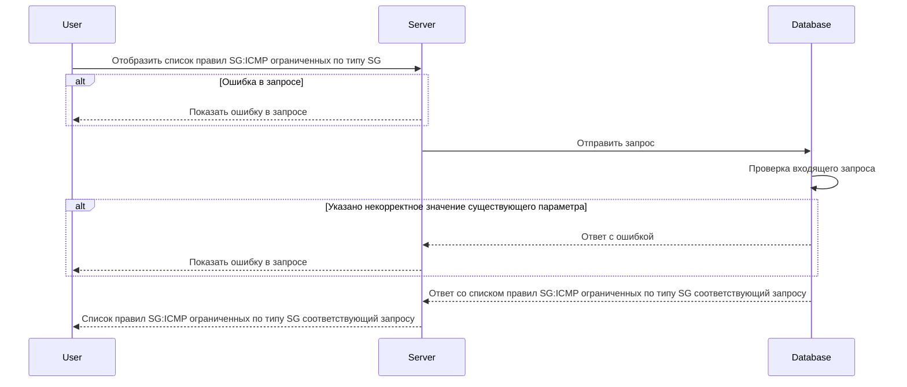

import { FancyboxDiagram } from '@site/src/components/commonBlocks/FancyboxDiagram'
import { RESPOND_CODES } from '@site/src/constants/errorCodes.tsx'
import Codes from '@site/src/components/commonBlocks/Codes/_Codes.mdx'

# POST /v1/sg-icmp/rules

## **Запрос**

`POST /v1/sg-icmp/rules`

<ul>
  <li>
    если в теле запроса указать одно или более sg - значений из имён источников Security Groups (sg), то получим ответ
    по указанным SG:ICMP правилам
  </li>
  <li>
    если в теле запроса указать пустой массив sgFrom или пустое тело запроса, то получим ответ со всеми существующими
    SG:ICMP правилами
  </li>
  <li>если указано некорректное тело в запросе, то получим ответ со всеми существующими SG:ICMP правилами</li>
</ul>

```json
{
  "sg": ["string"]
}
```

## **Ответ**

```json
{
  "rules": [
    {
      "Sg": "sg-0",
      "ICMP": {
        "IPv": "IPv4",
        "Types": [0]
      },
      "logs": true,
      "trace": true
    }
  ]
}
```

## **Входные параметры**

<div className="scrollable-x">
  <table>
    <thead>
      <tr>
        <th>№</th>
        <th>Параметр</th>
        <th>Тип данных</th>
        <th>Обязательность</th>
        <th>Описание</th>
        <th>Варианты значений</th>
      </tr>
    </thead>
    <tbody>
      <tr>
        <td>1</td>
        <td>sg</td>
        <td>array of strings</td>
        <td>lf</td>
        <td>массив из уникальных имен SG</td>
        <td>SG-11</td>
      </tr>
    </tbody>
  </table>
</div>

## **Проверки**

<div className="scrollable-x">
  <table>
    <thead>
      <tr>
        <th>Параметр</th>
        <th>Условие</th>
      </tr>
    </thead>
    <tbody>
      <tr>
        <td>sg</td>
        <td>
          \- длина значения не должна превышать 256 символов
          <br />
          \- значение должно начинаться и заканчиваться символами без пробелов
        </td>
      </tr>
    </tbody>
  </table>
</div>

## **Выходные параметры**

### **Положительный ответ**

<div className="scrollable-x">
  <table>
    <thead>
      <tr>
        <th>№</th>
        <th>Параметр</th>
        <th>Тип данных</th>
        <th>Описание</th>
        <th>Варианты значений</th>
      </tr>
    </thead>
    <tbody>
      <tr>
        <td>1</td>
        <td>rules</td>
        <td>array of objects</td>
        <td></td>
        <td>\-</td>
      </tr>
      <tr>
        <td>1.1</td>
        <td>rules[].Sg</td>
        <td>string</td>
        <td>уникальное имя security group</td>
        <td>sg-0</td>
      </tr>
      <tr>
        <td>1.2</td>
        <td>rules[].ICMP</td>
        <td>object</td>
        <td></td>
        <td>\-</td>
      </tr>
      <tr>
        <td>1.2.1</td>
        <td>rules[].ICMP.IPv</td>
        <td>string</td>
        <td>версия интернет-протокола</td>
        <td>IPv4/IPv6</td>
      </tr>
      <tr>
        <td>1.2.2</td>
        <td>rules[].ICMP.Types</td>
        <td>array of integers</td>
        <td>массив кодов типа ICMP</td>
        <td>0, 8, 100</td>
      </tr>
      <tr>
        <td>1.3</td>
        <td>rules[].logs</td>
        <td>bool</td>
        <td>включено или выключено логирование (по умолчанию выключено)</td>
        <td>true/false</td>
      </tr>
      <tr>
        <td>1.4</td>
        <td>rules[].trace</td>
        <td>bool</td>
        <td>включена или выключена трассировка(по умолчанию выключена)</td>
        <td>true/false</td>
      </tr>
    </tbody>
  </table>
</div>

### **Ответ с ошибками**

<Codes data = {RESPOND_CODES.internal} />
<Codes data = {RESPOND_CODES.not_found} />

## **Описание интеграции**

<FancyboxDiagram>



</FancyboxDiagram>
