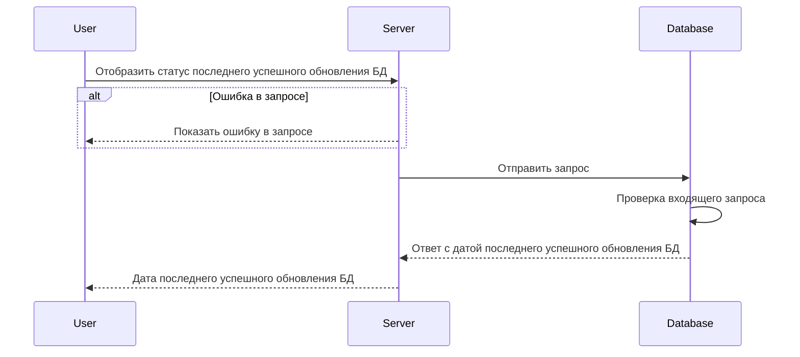

import { FancyboxDiagram } from '@site/src/components/commonBlocks/FancyboxDiagram'
import { RESPOND_CODES } from '@site/src/constants/errorCodes.tsx'


# GET /v1/sync/status

## **Запрос**

`GET /v1/sync/status`

## **Ответ**

```json
{
  "updatedAt": "2023-11-21T17:02:30.717786Z"
}
```

## **Выходные параметры**

### **Положительный ответ**

<div class="scrollable-x">
  <table>
    <thead>
      <tr>
        <th>№</th>
        <th>Параметр</th>
        <th>Тип данных</th>
        <th>Описание</th>
        <th>Варианты значений</th>
      </tr>
    </thead>
    <tbody>
      <tr>
        <td>1</td>
        <td>updatedAt</td>
        <td>string</td>
        <td>дата последнего успешного изменения</td>
        <td>2023-11-21T17:02:30.717786Z</td>
      </tr>
    </tbody>
  </table>
</div>

### **Ответ с ошибками**

Код ошибки 404

{RESPOND_CODES.not_found.grpcCode}

- Ошибка в запросе

```json
{
  "code": 5,
  "details": [],
  "message": "Not Found"
}
```

## **Описание интеграции**

<FancyboxDiagram>



</FancyboxDiagram>
