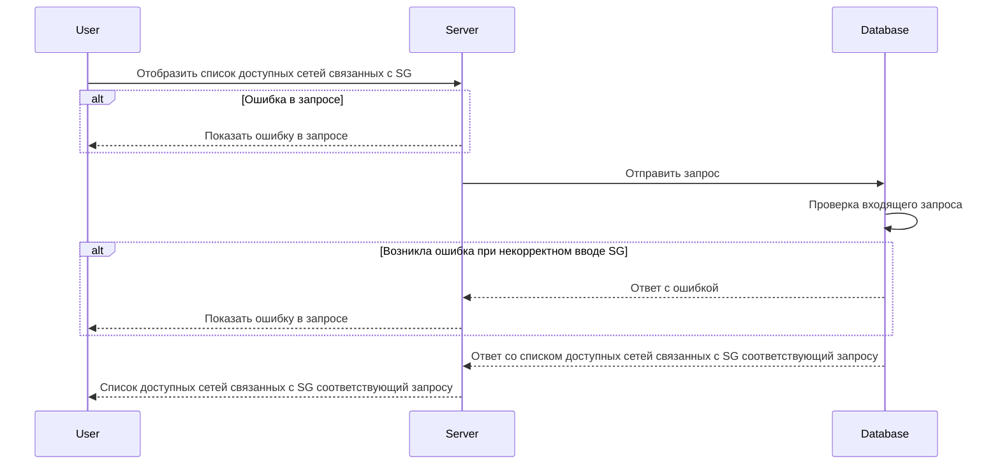

import { FancyboxDiagram } from '@site/src/components/commonBlocks/FancyboxDiagram'
import { RESPOND_CODES } from '@site/src/constants/errorCodes.tsx'

# GET /v1/sg/\{sgName\}/subnets

## **Запрос**

`GET /v1/sg/{sgName}/subnets`

## **Ответ**

```json
{
  "networks": [
    {
      "name": "nw-2",
      "network": {
        "CIDR": "10.150.0.222/32"
      }
    }
  ]
}
```

## **Входные параметры**

<div className="scrollable-x">
  <table>
    <thead>
      <tr>
        <th>№</th>
        <th>Параметр</th>
        <th>Тип данных</th>
        <th>Обязательность</th>
        <th>Описание</th>
        <th>Варианты значений</th>
      </tr>
    </thead>
    <tbody>
      <tr>
        <td>1</td>
        <td>\{sgName\}</td>
        <td>string</td>
        <td>да</td>
        <td>уникальное имя sg</td>
        <td>SG-11</td>
      </tr>
    </tbody>
  </table>
</div>

## **Проверки**

<div className="scrollable-x">
  <table>
    <thead>
      <tr>
        <th>Параметр</th>
        <th>Условие</th>
      </tr>
    </thead>
    <tbody>
      <tr>
        <td>\{sgName\}</td>
        <td>\- длина значения не должна превышать 256 символов<br />\- значение должно начинаться и заканчиваться символами без пробелов</td>
      </tr>
    </tbody>
  </table>
</div>

## **Выходные параметры**

### **Положительный ответ**

<div className="scrollable-x">
  <table>
    <thead>
      <tr>
        <th>№</th>
        <th>Параметр</th>
        <th>Тип данных</th>
        <th>Описание</th>
        <th>Варианты значений</th>
      </tr>
    </thead>
    <tbody>
      <tr>
        <td>1</td>
        <td>networks</td>
        <td>array of objects</td>
        <td></td>
        <td>\-</td>
      </tr>
      <tr>
        <td>1.1</td>
        <td>networks[].name</td>
        <td>string</td>
        <td>уникальное имя сети</td>
        <td>nw-1</td>
      </tr>
      <tr>
        <td>1.2</td>
        <td>networks[].network</td>
        <td>object</td>
        <td></td>
        <td>\-</td>
      </tr>
      <tr>
        <td>1.3</td>
        <td>networks[].network.CIDR</td>
        <td>string</td>
        <td></td>
        <td>10.150.0.220/32</td>
      </tr>
    </tbody>
  </table>
</div>

### **Ответ с ошибками**

{RESPOND_CODES.internal.grpcCode}
{RESPOND_CODES.not_found.grpcCode}

Код ошибки 404

- Указано неверное значение \{sgName\}

```json
{
  "code": 5,
  "details": [],
  "message": "SG 'string' is not found"
}
```

- Ошибка в запросе

```json
{
  "code": 5,
  "details": [],
  "message": "Not Found"
}
```

## **Описание интеграции**

<FancyboxDiagram>



</FancyboxDiagram>
