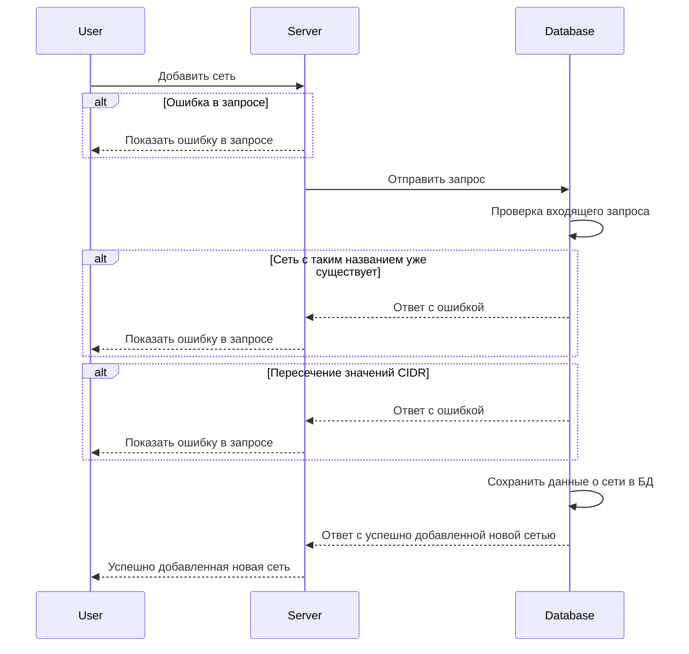
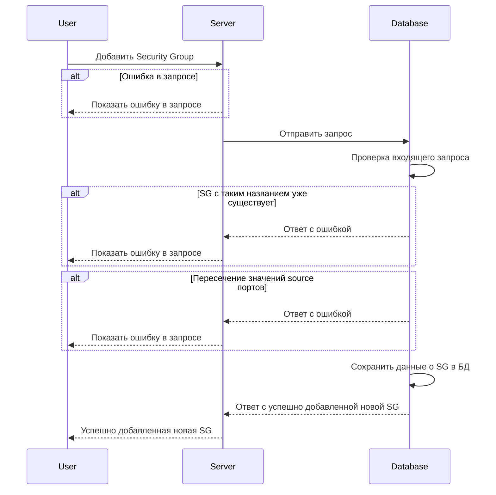
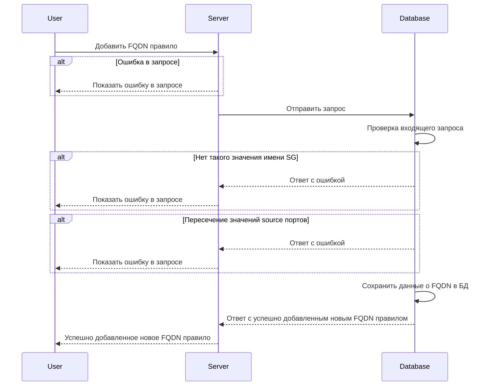
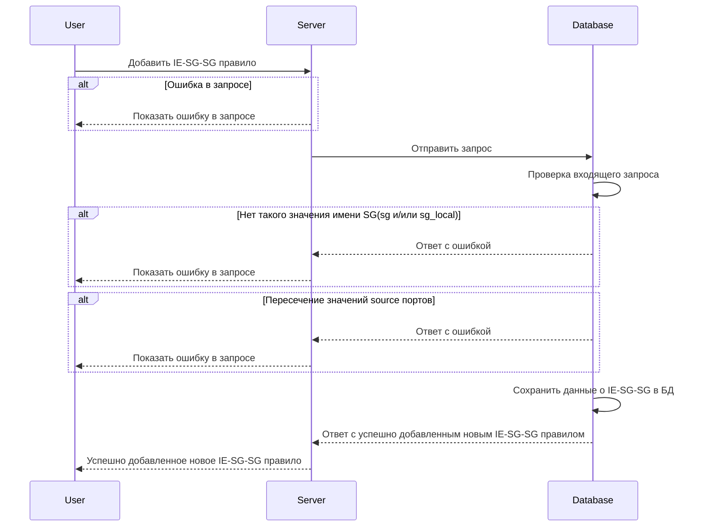
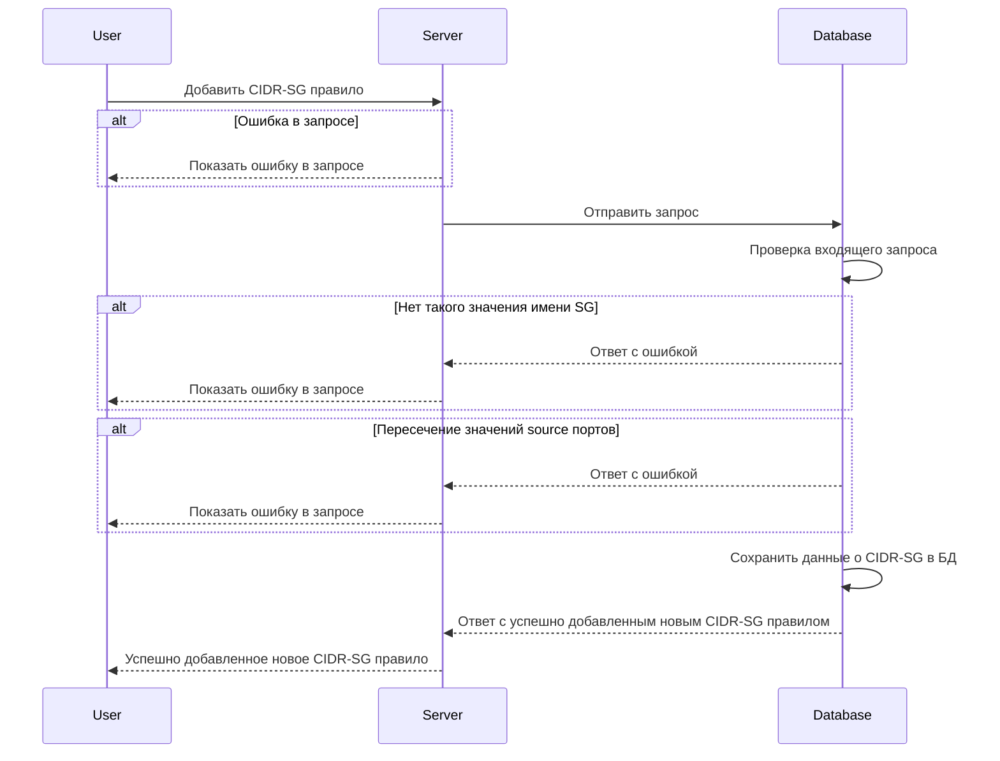
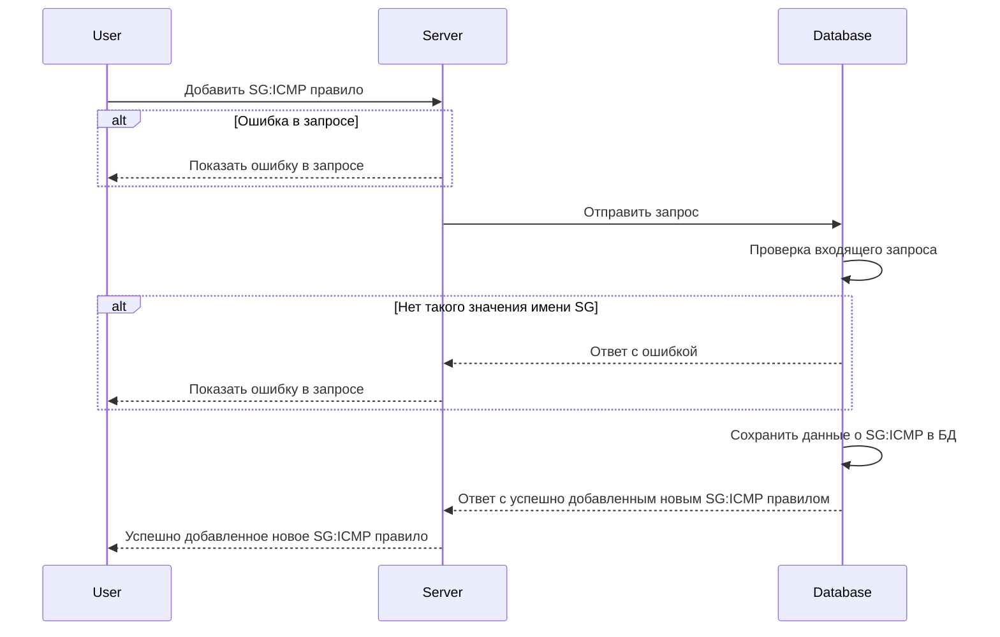
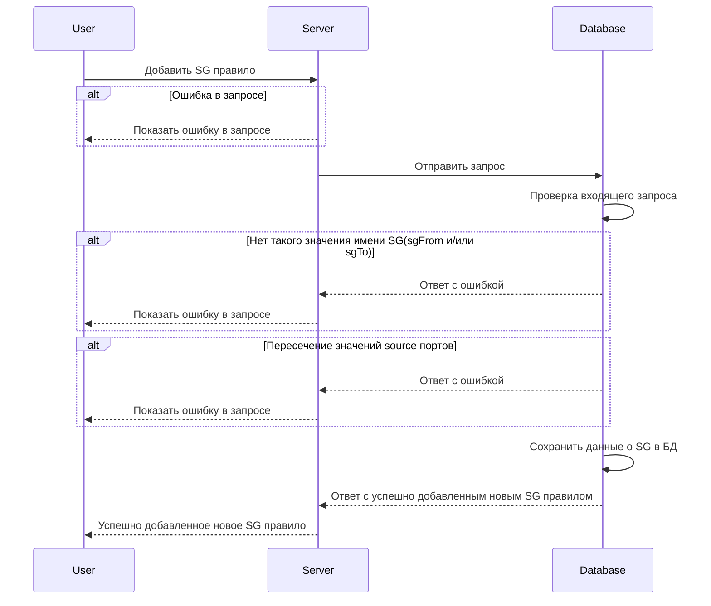

import Tabs from '@theme/Tabs'
import TabItem from '@theme/TabItem'
import { FancyboxDiagram } from '@site/src/components/commonBlocks/FancyboxDiagram'
import ApiNetworks from '@site/src/snippets/networks/_Api.mdx'
import ApiSg from '@site/src/snippets/securityGroups/_Api.mdx'
import ApiS2sie from '@site/src/snippets/s2s-ie/_Api.mdx'
import ApiS2s from '@site/src/snippets/s2s/_Api.mdx'
import ApiS2f from '@site/src/snippets/s2f-e/_Api.mdx'
import ApiS2c from '@site/src/snippets/s2c-ie/_Api.mdx'

# POST /v1/sync

## **Описание**

<ul>
  <li className="text-justify">
  Этот метод позволяет добавить или удалить сеть (network), Security Group и правила взаимодействия между Security Group, FQDN или CIDR. 
  </li>
  <li className="text-justify">
  При удалении сети все принадлежащие ей Security Group и правила так же будут удалены.
  </li>
  <li className="text-justify">
  При удалении Security Group все принадлежащие ей правила так же будут удалены.
  </li>
</ul>

<Tabs
    defaltValue = "nw"
    values = {[
        { label: "Networks", value: "nw" },
        { label: "Security Groups", value: "sg" },
        { label: "Rules", value: "rules" },
    ]}
>

    <TabItem value="nw">
        <ApiNetworks />
    </TabItem>

    <TabItem value="sg">
        <ApiSg />
    </TabItem>

<<<<<<< HEAD
    <TabItem value="rules">
    <Tabs
        defaltValue = 's2s'
        values = {[
          {label: 'Sgroup to Sgroup', value: 's2s'},
          {label: 'Sgroup to Sgroup (I/E)', value: 's2s-ie'},
          {label: 'Sgroup to CIDR (I/E)', value: 's2c'},
          {label: 'Sgroup to FQDN (E)', value: 's2f'},
        ]}
>

    <TabItem value='s2s'>
      <ApiS2s />
    </TabItem>
    <TabItem value='s2s-ie'>
      <ApiS2sie />
    </TabItem>
    <TabItem value='s2c'>
      <ApiS2c />
    </TabItem>
    <TabItem value='s2f'>
      <ApiS2c />
    </TabItem>
    </Tabs>
    </TabItem>
=======

</FancyboxDiagram>

</TabItem>
<TabItem value='sg'>

<FancyboxDiagram>

</FancyboxDiagram>

</TabItem>
<TabItem value='rules'>

<Tabs
defaltValue = 'fqdn'
values = {[
  {label: 'FQDN', value: 'fqdn'},
  {label: 'i/e Sg-Sg', value: 'ie-sg-sg'},
  {label: 'CIDR-Sg', value: 'cidr-sg'},
  {label: 'Sg:ICMP', value: 'sg-icmp'},
  {label: 'Sg-Sg:ICMP', value: 'sg-sg-icmp'},
  {label: 'Sg', value: 'rsg'}
]}
>

<TabItem value='fqdn'>

<FancyboxDiagram>

</FancyboxDiagram>

</TabItem>
<TabItem value='ie-sg-sg'>

<FancyboxDiagram>

</FancyboxDiagram>

</TabItem>
<TabItem value='cidr-sg'>

<FancyboxDiagram>

</FancyboxDiagram>

</TabItem>
<TabItem value='sg-icmp'>

<FancyboxDiagram>

</FancyboxDiagram>

</TabItem>
<TabItem value='sg-sg-icmp'>

<FancyboxDiagram>

</FancyboxDiagram>

</TabItem>
<TabItem value='rsg'>

<FancyboxDiagram>

</FancyboxDiagram>

</TabItem>
>>>>>>> 94a150c388319eb086f6e59fa979f5ab09aebd15
</Tabs>

