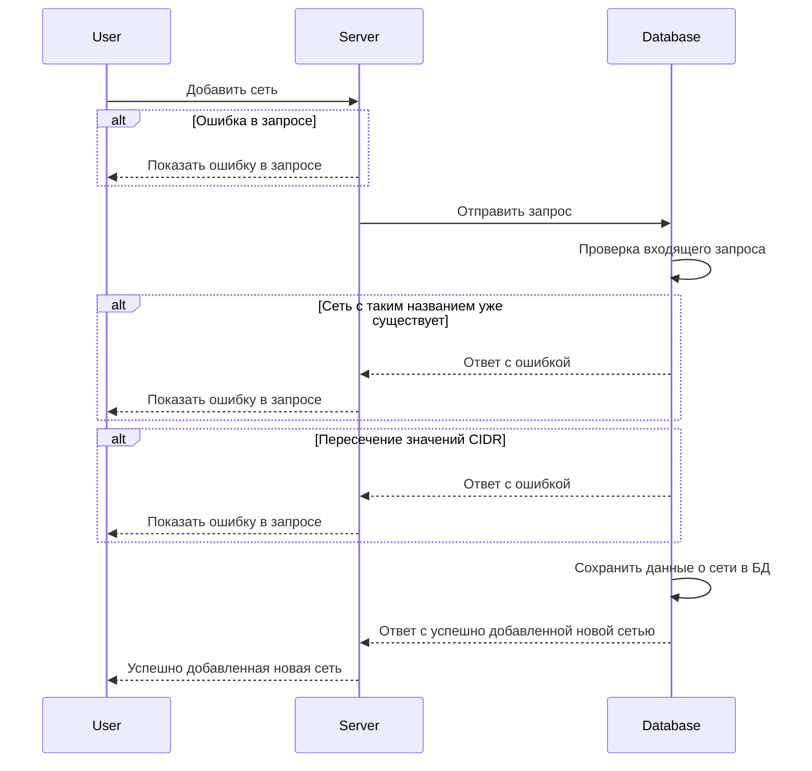
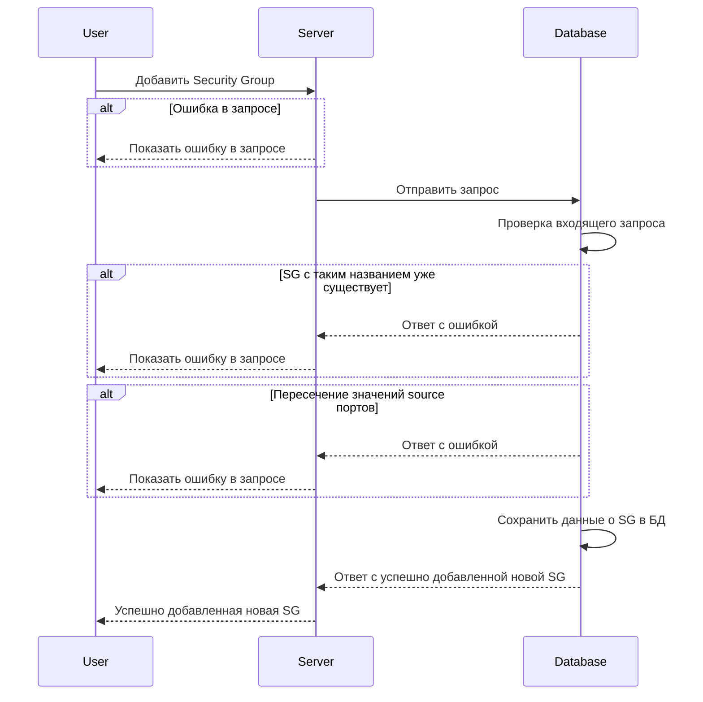
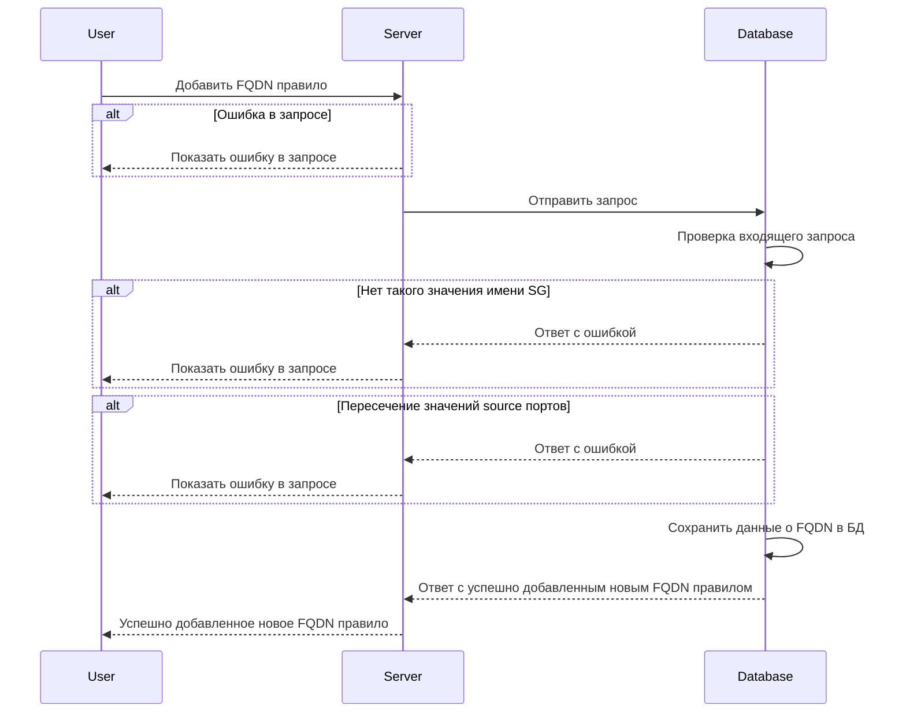
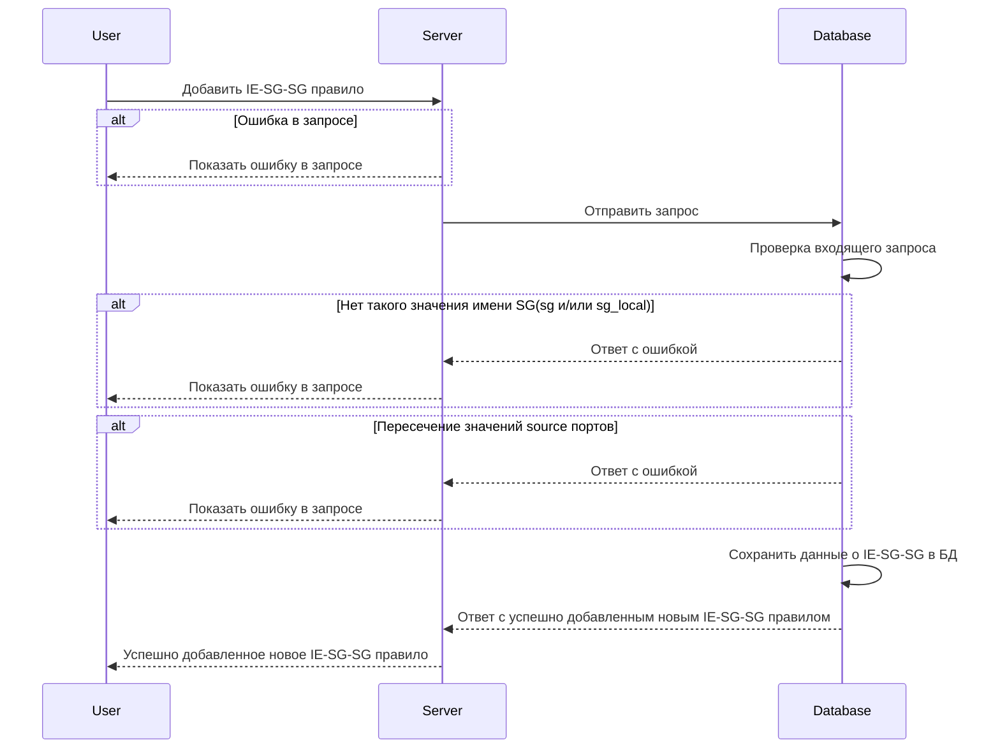
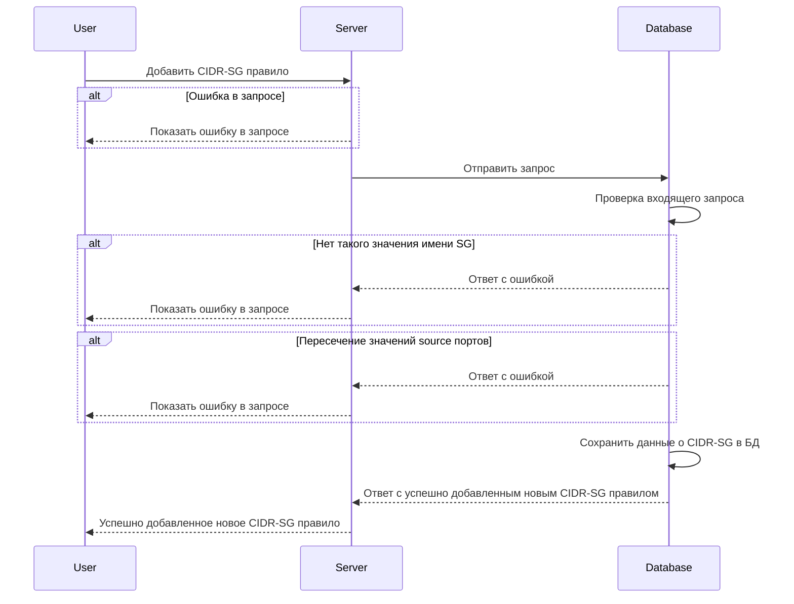
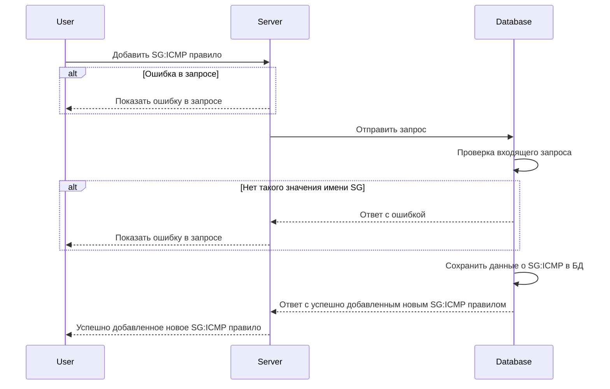
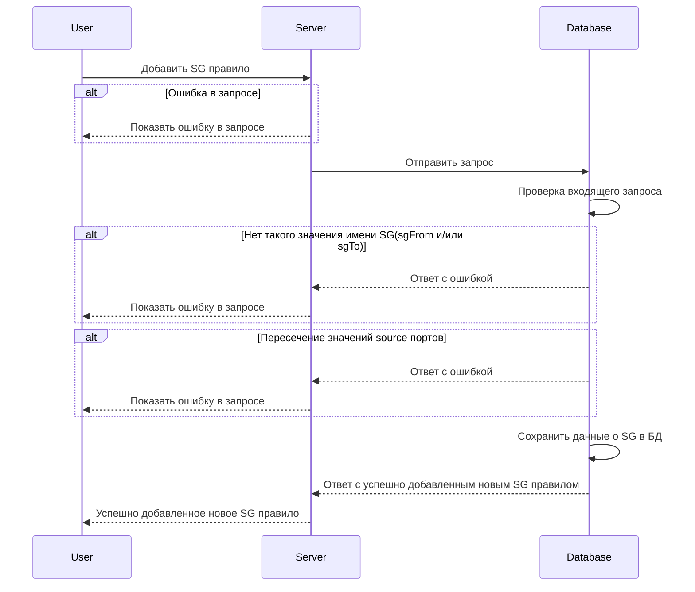

import Tabs from '@theme/Tabs'
import TabItem from '@theme/TabItem'
import { FancyboxDiagram } from '@site/src/components/commonBlocks/FancyboxDiagram'

# POST /v1/sync

## **Запрос**

`POST /v1/sync`

<ul>
  <li className="text-justify">
    можно отдельно добавить/удалить сеть (network) указав в теле только 5 и 9 пункты из входных параметров, при удалении
    сети все принадлежащие ей security group и правила так же будут удалены
  </li>
  <li className="text-justify">
    можно отдельно добавить/удалить security group (sg) указав в теле только 4 и 9 пункты из входных параметров
    (предварительно необходимо создать сеть по которой будет сформирована security group), при удалении security group
    все принадлежащие ей правила так же будут удалены
  </li>
  <li className="text-justify">
    можно отдельно добавить/удалить каждое из правил (предварительно для правила должны быть создана сеть и security
    group):
    <ul>
      <li>для добавления/удаления FQDN правил, в теле необходимо указать 3 и 9 пункты из входных параметров</li>
      <li>для добавления/удаления CIDR-SG правил, в теле необходимо указать 2 и 9 пункты из входных параметров</li>
      <li>для добавления/удаления SG:ICMP правил, в теле необходимо указать 6 и 9 пункты из входных параметров</li>
      <li>для добавления/удаления SG-SG:ICMP правил, в теле необходимо добавить 8 и 9 пункты из входных параметров</li>
      <li>для добавления/удаления SG правил, в теле необходимо добавить 7 и 9 пункты из входных параметров</li>
      <li>для добавления/удаления IE-SG-SG правил, в теле необходимо указать 1 и 9 пункты из входных параметров</li>
    </ul>
  </li>
</ul>

```json
{
  "sgSgRules": {
    "rules": [
      {
        "sg": "string",
        "sg_local": "string",
        "logs": true,
        "trace": true,
        "ports": [
          {
            "d": "string",
            "s": "string"
          }
        ],
        "traffic": "Ingress",
        "transport": "TCP"
      }
    ]
  },
  "cidrSgRules": {
    "rules": [
      {
        "CIDR": "string",
        "SG": "string",
        "logs": true,
        "ports": [
          {
            "d": "string",
            "s": "string"
          }
        ],
        "trace": true,
        "traffic": "Undef",
        "transport": "TCP"
      }
    ]
  },
  "fqdnRules": {
    "rules": [
      {
        "FQDN": "string",
        "logs": true,
        "ports": [
          {
            "d": "string",
            "s": "string"
          }
        ],
        "sgFrom": "string",
        "transport": "TCP",
        "protocols": ["http", "ssh"]
      }
    ]
  },
  "groups": {
    "groups": [
      {
        "defaultAction": "DEFAULT",
        "logs": true,
        "name": "string",
        "networks": ["string"],
        "trace": true
      }
    ]
  },
  "networks": {
    "networks": [
      {
        "name": "string",
        "network": {
          "CIDR": "string"
        }
      }
    ]
  },
  "sgIcmpRules": {
    "rules": [
      {
        "ICMP": {
          "IPv": "_",
          "Types": [0]
        },
        "Sg": "string",
        "logs": true,
        "trace": true
      }
    ]
  },
  "sgRules": {
    "rules": [
      {
        "logs": true,
        "ports": [
          {
            "d": "string",
            "s": "string"
          }
        ],
        "sgFrom": "string",
        "sgTo": "string",
        "transport": "TCP"
      }
    ]
  },
  "sgSgIcmpRules": {
    "rules": [
      {
        "ICMP": {
          "IPv": "_",
          "Types": [0]
        },
        "SgFrom": "string",
        "SgTo": "string",
        "logs": true,
        "trace": true
      }
    ]
  },
  "syncOp": "FullSync"
}
```

## **Ответ**

```json
{}
```

## **Входные параметры**

<div class="scrollable-x">
  <table>
    <thead>
      <tr>
        <th>№</th>
        <th>Параметр</th>
        <th>Тип данных</th>
        <th>Обязательность</th>
        <th>Описание</th>
        <th>Варианты значений</th>
      </tr>
    </thead>
    <tbody>
      <tr>
        <td>1</td>
        <td>sgSgRules</td>
        <td>objects of objects</td>
        <td>нет</td>
        <td></td>
        <td>\-</td>
      </tr>
      <tr>
        <td>1\.2</td>
        <td>sgSgRules.rules</td>
        <td>array of objects</td>
        <td>нет</td>
        <td></td>
        <td>\-</td>
      </tr>
      <tr>
        <td>1\.3</td>
        <td>sgSgRules.rules[].sg</td>
        <td>string</td>
        <td>нет</td>
        <td>уникальное имя security group</td>
        <td>SG-11</td>
      </tr>
      <tr>
        <td>1\.4</td>
        <td>sgSgRules.rules[].sg_local</td>
        <td>string</td>
        <td>нет</td>
        <td>уникальное имя security group</td>
        <td>SG-11</td>
      </tr>
      <tr>
        <td>1\.5</td>
        <td>sgSgRules.rules[].logs</td>
        <td>bool</td>
        <td>нет</td>
        <td>включить или выключить логирование (по умолчанию выкл)</td>
        <td>true/false</td>
      </tr>
      <tr>
        <td>1\.6</td>
        <td>sgSgRules.rules[].trace</td>
        <td>bool</td>
        <td>нет</td>
        <td>включить или выключить трассировку(по умолчанию выкл)</td>
        <td>true/false</td>
      </tr>
      <tr>
        <td>1\.7</td>
        <td>sgSgRules.rules[].ports</td>
        <td>array of objects</td>
        <td>нет</td>
        <td></td>
        <td>\-</td>
      </tr>
      <tr>
        <td>1\.7.1</td>
        <td>sgSgRules.rules[].ports[].d</td>
        <td>string</td>
        <td>нет</td>
        <td></td>
        <td>7600-7700,7800</td>
      </tr>
      <tr>
        <td>1\.7.2</td>
        <td>sgSgRules.rules[].ports[].s</td>
        <td>string</td>
        <td>нет</td>
        <td></td>
        <td>4446</td>
      </tr>
      <tr>
        <td>1\.8</td>
        <td>sgSgRules.rules[].traffic</td>
        <td>string</td>
        <td>нет</td>
        <td>тип траффика (входящий, исходящий или неопределенный)</td>
        <td>&quot;ingress&quot;/&quot;egress&quot;/&quot;undef&quot;</td>
      </tr>
      <tr>
        <td>1\.9</td>
        <td>sgSgRules.rules[].transport</td>
        <td>string</td>
        <td>нет</td>
        <td>метод передачи данных</td>
        <td>&quot;TCP&quot;/&quot;UDP&quot;</td>
      </tr>
      <tr>
        <td>2</td>
        <td>cidrSgRules</td>
        <td>objects of objects</td>
        <td>нет</td>
        <td></td>
        <td>\-</td>
      </tr>
      <tr>
        <td>2\.1</td>
        <td>cidrSgRules.rules</td>
        <td>array of objects</td>
        <td>нет</td>
        <td></td>
        <td>\-</td>
      </tr>
      <tr>
        <td>2\.1.1</td>
        <td>cidrSgRules.rules[].CIDR</td>
        <td>string</td>
        <td>нет</td>
        <td></td>
        <td>10\.10.0.8/30</td>
      </tr>
      <tr>
        <td>2\.1.2</td>
        <td>cidrSgRules.rules[].SG</td>
        <td>string</td>
        <td>нет</td>
        <td>уникальное имя security group</td>
        <td>sg-0</td>
      </tr>
      <tr>
        <td>2\.1.3</td>
        <td>cidrSgRules.rules[].logs</td>
        <td>bool</td>
        <td>нет</td>
        <td>включить или выключить логирование (по умолчанию выкл)</td>
        <td>true/false</td>
      </tr>
      <tr>
        <td>2\.1.4</td>
        <td>cidrSgRules.rules[].ports</td>
        <td>array of objects</td>
        <td>нет</td>
        <td></td>
        <td>\-</td>
      </tr>
      <tr>
        <td>2\.1.4.1</td>
        <td>cidrSgRules.rules[].ports[].d</td>
        <td>string</td>
        <td>нет</td>
        <td></td>
        <td>7600-7700,7800</td>
      </tr>
      <tr>
        <td>2\.1.4.2</td>
        <td>cidrSgRules.rules[].ports[].s</td>
        <td>string</td>
        <td>нет</td>
        <td></td>
        <td>4446</td>
      </tr>
      <tr>
        <td>2\.1.5</td>
        <td>cidrSgRules.rules[].trace</td>
        <td>bool</td>
        <td>нет</td>
        <td>включить или выключить трассировку(по умолчанию выкл)</td>
        <td>true/false</td>
      </tr>
      <tr>
        <td>2\.1.6</td>
        <td>cidrSgRules.rules[].traffic</td>
        <td>string</td>
        <td>нет</td>
        <td>тип траффика (входящий, исходящий или неопределенный)</td>
        <td>&quot;ingress&quot;/&quot;egress&quot;/&quot;undef&quot;</td>
      </tr>
      <tr>
        <td>2\.1.7</td>
        <td>cidrSgRules.rules[].transport</td>
        <td>string</td>
        <td>нет</td>
        <td>метод передачи данных</td>
        <td>&quot;TCP&quot;/&quot;UDP&quot;</td>
      </tr>
      <tr>
        <td>3</td>
        <td>fqdnRules</td>
        <td>objects of objects</td>
        <td>нет</td>
        <td></td>
        <td>\-</td>
      </tr>
      <tr>
        <td>3\.1</td>
        <td>fqdnRules.rules</td>
        <td>array of objects</td>
        <td>нет</td>
        <td></td>
        <td>\-</td>
      </tr>
      <tr>
        <td>3\.1.1</td>
        <td>fqdnRules.rules[].FQDN</td>
        <td>string</td>
        <td>нет</td>
        <td>максимальная длина значения не должна превышать 256 символов</td>
        <td>google.com</td>
      </tr>
      <tr>
        <td>3\.1.2</td>
        <td>fqdnRules.rules[].logs</td>
        <td>bool</td>
        <td>нет</td>
        <td>включить или выключить логирование (по умолчанию выкл)</td>
        <td>true/false</td>
      </tr>
      <tr>
        <td>3\.1.3</td>
        <td>fqdnRules.rules[].ports</td>
        <td>array of objects</td>
        <td>нет</td>
        <td></td>
        <td>\-</td>
      </tr>
      <tr>
        <td>3\.1.3.1</td>
        <td>fqdnRules.rules[].ports[].d</td>
        <td>string</td>
        <td>нет</td>
        <td></td>
        <td>7600-7700,7800</td>
      </tr>
      <tr>
        <td>3\.1.3.2</td>
        <td>fqdnRules.rules[].ports[].s</td>
        <td>string</td>
        <td>нет</td>
        <td></td>
        <td>4446</td>
      </tr>
      <tr>
        <td>3\.1.4</td>
        <td>fqdnRules.rules[].sgFrom</td>
        <td>string</td>
        <td>нет</td>
        <td>уникальное имя security group</td>
        <td>SG-11</td>
      </tr>
      <tr>
        <td>3\.1.5</td>
        <td>fqdnRules.rules[].transport</td>
        <td>string</td>
        <td>нет</td>
        <td>метод передачи данных</td>
        <td>&quot;TCP&quot;/&quot;UDP&quot;</td>
      </tr>
      <tr>
        <td>3\.1.6</td>
        <td>fqdnRules.rules[].protocols</td>
        <td>array of string</td>
        <td>да</td>
        <td>значения протоколов</td>
        <td>&quot;http&quot;, &quot;ssh&quot;</td>
      </tr>
      <tr>
        <td>4</td>
        <td>groups</td>
        <td>objects of objects</td>
        <td>нет</td>
        <td></td>
        <td>\-</td>
      </tr>
      <tr>
        <td>4\.1</td>
        <td>groups.groups</td>
        <td>array of objects</td>
        <td>нет</td>
        <td></td>
        <td>\-</td>
      </tr>
      <tr>
        <td>4\.1.1</td>
        <td>groups.groups[].defaultAction</td>
        <td>string</td>
        <td>нет</td>
        <td>представляет действие по умолчанию в конце цепочек для SG</td>
        <td>DEFAULT, DROP, ACCEPT</td>
      </tr>
      <tr>
        <td>4\.1.2</td>
        <td>groups.groups[].logs</td>
        <td>bool</td>
        <td>нет</td>
        <td>включить или выключить логирование (по умолчанию выкл)</td>
        <td>true/false</td>
      </tr>
      <tr>
        <td>4\.1.3</td>
        <td>groups.groups[].name</td>
        <td>string</td>
        <td>нет</td>
        <td>уникальное имя сети</td>
        <td>ntw-1</td>
      </tr>
      <tr>
        <td>4\.1.4</td>
        <td>groups.groups[].networks</td>
        <td>array</td>
        <td>нет</td>
        <td></td>
        <td>\-</td>
      </tr>
      <tr>
        <td>4\.1.5</td>
        <td>groups.groups[].trace</td>
        <td>bool</td>
        <td>нет</td>
        <td>включить или выключить трассировку(по умолчанию выкл)</td>
        <td>true/false</td>
      </tr>
      <tr>
        <td>5</td>
        <td>networks</td>
        <td>objects of objects</td>
        <td>нет</td>
        <td></td>
        <td>\-</td>
      </tr>
      <tr>
        <td>5\.1</td>
        <td>networks.networks</td>
        <td>array of objects</td>
        <td>нет</td>
        <td></td>
        <td>\-</td>
      </tr>
      <tr>
        <td>5\.1.1</td>
        <td>networks.networks[].name</td>
        <td>string</td>
        <td>нет</td>
        <td>уникальное имя сети</td>
        <td>ntw-1</td>
      </tr>
      <tr>
        <td>5\.1.2</td>
        <td>networks.networks[].network</td>
        <td>objects of objects</td>
        <td>нет</td>
        <td></td>
        <td>\-</td>
      </tr>
      <tr>
        <td>5\.1.2.1</td>
        <td>networks.networks[].network.CIDR</td>
        <td>string</td>
        <td>нет</td>
        <td></td>
        <td>10\.150.0.224/32</td>
      </tr>
      <tr>
        <td>6</td>
        <td>sgIcmpRules</td>
        <td>objects</td>
        <td>нет</td>
        <td></td>
        <td>\-</td>
      </tr>
      <tr>
        <td>6\.1</td>
        <td>sgIcmpRules.rules</td>
        <td>array of objects</td>
        <td>нет</td>
        <td></td>
        <td>\-</td>
      </tr>
      <tr>
        <td>6\.1.1</td>
        <td>sgIcmpRules.rules[].ICMP</td>
        <td>objects</td>
        <td>нет</td>
        <td></td>
        <td>\-</td>
      </tr>
      <tr>
        <td>6\.1.1.1</td>
        <td>sgIcmpRules.rules[].ICMP.IPv</td>
        <td>IPv4/IPv6</td>
        <td>нет</td>
        <td>версия интернет-протокола</td>
        <td>&quot;IPv4&quot;/&quot;IPv6&quot;</td>
      </tr>
      <tr>
        <td>6\.1.1.2</td>
        <td>sgIcmpRules.rules[].ICMP.Types</td>
        <td>array</td>
        <td>нет</td>
        <td>код типа ICMP</td>
        <td>0, 8, 100</td>
      </tr>
      <tr>
        <td>6\.1.2</td>
        <td>sgIcmpRules.rules[].Sg</td>
        <td>string</td>
        <td>нет</td>
        <td>уникальное имя security group</td>
        <td>SG-11</td>
      </tr>
      <tr>
        <td>6\.1.3</td>
        <td>sgIcmpRules.rules[].logs</td>
        <td>bool</td>
        <td>нет</td>
        <td>включить или выключить логирование (по умолчанию выкл)</td>
        <td>true/false</td>
      </tr>
      <tr>
        <td>6\.1.4</td>
        <td>sgIcmpRules.rules[].trace</td>
        <td>bool</td>
        <td>нет</td>
        <td>включить или выключить трассировку(по умолчанию выкл)</td>
        <td>true/false</td>
      </tr>
      <tr>
        <td>7</td>
        <td>sgRules</td>
        <td>objects of objects</td>
        <td>нет</td>
        <td></td>
        <td>\-</td>
      </tr>
      <tr>
        <td>7\.1</td>
        <td>sgRules.rules</td>
        <td>array of objects</td>
        <td>нет</td>
        <td></td>
        <td>\-</td>
      </tr>
      <tr>
        <td>7\.1.1</td>
        <td>sgRules.rules[].logs</td>
        <td>bool</td>
        <td>нет</td>
        <td>включить или выключить логирование (по умолчанию выкл)</td>
        <td>true/false</td>
      </tr>
      <tr>
        <td>7\.1.2</td>
        <td>sgRules.rules[].ports</td>
        <td>array of objects</td>
        <td>нет</td>
        <td>массив портов</td>
        <td>\-</td>
      </tr>
      <tr>
        <td>7\.1.2.1</td>
        <td>sgRules.rules[].ports[].d</td>
        <td>string</td>
        <td>нет</td>
        <td></td>
        <td>7600-7700,7800</td>
      </tr>
      <tr>
        <td>7\.1.2.2</td>
        <td>sgRules.rules[].ports[].s</td>
        <td>string</td>
        <td>нет</td>
        <td></td>
        <td>4446</td>
      </tr>
      <tr>
        <td>7\.1.3</td>
        <td>sgRules.rules[].sgFrom</td>
        <td>string</td>
        <td>нет</td>
        <td>уникальное имя security group from</td>
        <td>sg-0</td>
      </tr>
      <tr>
        <td>7\.1.4</td>
        <td>sgRules.rules[].sgTo</td>
        <td>string</td>
        <td>нет</td>
        <td>уникальное имя security group to</td>
        <td>SG-11</td>
      </tr>
      <tr>
        <td>7\.1.5</td>
        <td>sgRules.rules[].transport</td>
        <td>string</td>
        <td>нет</td>
        <td>метод передачи данных</td>
        <td>&quot;TCP&quot;/&quot;UDP&quot;</td>
      </tr>
      <tr>
        <td>8</td>
        <td>sgSgIcmpRules</td>
        <td>objects</td>
        <td>нет</td>
        <td></td>
        <td>\-</td>
      </tr>
      <tr>
        <td>8\.1</td>
        <td>sgSgIcmpRules.rules</td>
        <td>array of objects</td>
        <td>нет</td>
        <td></td>
        <td>\-</td>
      </tr>
      <tr>
        <td>8\.1.1</td>
        <td>sgSgIcmpRules.rules[].ICMP</td>
        <td>objects</td>
        <td>нет</td>
        <td></td>
        <td>\-</td>
      </tr>
      <tr>
        <td>8\.1.1.1</td>
        <td>sgSgIcmpRules.rules[].ICMP.IPv</td>
        <td>string</td>
        <td>нет</td>
        <td>версия интернет-протокола</td>
        <td>&quot;IPv4&quot;/&quot;IPv6&quot;</td>
      </tr>
      <tr>
        <td>8\.1.1.2</td>
        <td>sgSgIcmpRules.rules[].ICMP.Types</td>
        <td>array</td>
        <td>нет</td>
        <td>код типа ICMP</td>
        <td>0, 8, 100</td>
      </tr>
      <tr>
        <td>8\.1.2</td>
        <td>sgSgIcmpRules.rules[].SgFrom</td>
        <td>string</td>
        <td>нет</td>
        <td>уникальное имя security group from</td>
        <td>sg-0</td>
      </tr>
      <tr>
        <td>8\.1.3</td>
        <td>sgSgIcmpRules.rules[].SgTo</td>
        <td>string</td>
        <td>нет</td>
        <td>уникальное имя security group to</td>
        <td>SG-11</td>
      </tr>
      <tr>
        <td>8\.1.4</td>
        <td>sgSgIcmpRules.rules[].logs</td>
        <td>bool</td>
        <td>нет</td>
        <td>включить или выключить логирование (по умолчанию выкл)</td>
        <td>true/false</td>
      </tr>
      <tr>
        <td>8\.1.5</td>
        <td>sgSgIcmpRules.rules[].trace</td>
        <td>bool</td>
        <td>нет</td>
        <td>включить или выключить трассировку(по умолчанию выкл)</td>
        <td>true/false</td>
      </tr>
      <tr>
        <td>9</td>
        <td>syncOp</td>
        <td>string</td>
        <td>да</td>
        <td>
          <ul>
            <li>
              <b>Delete</b> - Удаление правила SG
            </li>
            <li>
              <b>UpSert</b> - Добавление нового правила SG (ранее добавленные сохраняются)
            </li>
            <li>
              <b>FullSync</b> - Добавление нового правила SG (ранее добавленные удаляются)
            </li>
          </ul>
          <i>необходимо явно указать одно из трех значений</i>
        </td>
        <td>&quot;Delete&quot;/&quot;UpSert&quot;/&quot;FullSync&quot;</td>
      </tr>
    </tbody>
  </table>
</div>

## **Выходные параметры**

### **Положительный ответ**

<div class="scrollable-x">
  <table>
    <thead>
      <tr>
        <th>№</th>
        <th>Параметр</th>
        <th>Тип данных</th>
        <th>Описание</th>
        <th>Варианты значений</th>
      </tr>
    </thead>
    <tbody>
      <tr>
        <td>1</td>
        <td>\-</td>
        <td>object</td>
        <td>в случае успеха возвращается пустое тело</td>
        <td>\-</td>
      </tr>
    </tbody>
  </table>
</div>

### **Ответ с ошибками**

Код ошибки 500

- Сеть с таким названием уже существует

```json
{
  "code": 13,
  "details": [],
  "message": "ERROR: conflicting key value violates exclusion constraint \"prevent_networks_intersections\" (SQLSTATE 23P01)"
}
```

- Пересечение значений CIDR

```json
{
  "code": 3,
  "details": [],
  "message": "the '200.150.0.225/28' seems just an IP address; the address of network is expected instead"
}
```

- Пересечение значений source портов

```json
{
  "code": 13,
  "details": [],
  "message": "ERROR: new row for relation \"tbl_sg_rule\" violates check constraint \"S_ports_dont_intersect\" (SQLSTATE 23514)"
}
```

- Некорректное значение кода ICMP

```json
{
  "code": 3,
  "details": [],
  "message": "ICMP type(s) must be in [0-255] but we got (256)"
}
```

- Нет такого значения имени SG

```json
{
  "code": 13,
  "details": [],
  "message": "ERROR: related SG(sg-no-exist) is not exist (SQLSTATE P0001)"
}
```

- Некорректное значение IPv

```json
{
  "code": 3,
  "details": [],
  "message": "proto: (line 6:27): invalid value for enum type: \"IPv10\""
}
```

- Добавление несуществующей сети в SG

```json
{
  "code": 13,
  "details": [],
  "message": "ERROR: unable bind Net(nw-nonexist)-->SG(sg-with-nonexist-nw) cause such Net does not exist (SQLSTATE P0001)"
}
```

- Добавление несуществующего SG к правилу

```json
{
  "code": 13,
  "details": [],
  "message": "ERROR: on check SG-From it found the SG(sg-nonexist-1) not exist (SQLSTATE P0001)"
}
```

Код ошибки 404

- Ошибка в запросе

```json
{
  "code": 5,
  "details": [],
  "message": "Not Found"
}
```

## **Описание интеграции**

<Tabs
defaltValue = 'nw'
values = {[
  { label: 'Networks', value: 'nw' },
  { label: 'Security Groups', value: 'sg' },
  { label: 'Rules', value: 'rules' }
]}
>

<TabItem value='nw'>

<FancyboxDiagram>



</FancyboxDiagram>

</TabItem>
<TabItem value='sg'>

<FancyboxDiagram>



</FancyboxDiagram>

</TabItem>
<TabItem value='rules'>

<Tabs
defaltValue = 'fqdn'
values = {[
  {label: 'FQDN', value: 'fqdn'},
  {label: 'i/e Sg-Sg', value: 'ie-sg-sg'},
  {label: 'CIDR-Sg', value: 'cidr-sg'},
  {label: 'Sg:ICMP', value: 'sg-icmp'},
  {label: 'Sg-Sg:ICMP', value: 'sg-sg-icmp'},
  {label: 'Sg', value: 'rsg'}
]}
>

<TabItem value='fqdn'>

<FancyboxDiagram>



</FancyboxDiagram>

</TabItem>
<TabItem value='ie-sg-sg'>

<FancyboxDiagram>



</FancyboxDiagram>

</TabItem>
<TabItem value='cidr-sg'>

<FancyboxDiagram>



</FancyboxDiagram>

</TabItem>
<TabItem value='sg-icmp'>

<FancyboxDiagram>



</FancyboxDiagram>

</TabItem>
<TabItem value='sg-sg-icmp'>

<FancyboxDiagram>


</FancyboxDiagram>

</TabItem>
<TabItem value='rsg'>

<FancyboxDiagram>



</FancyboxDiagram>

</TabItem>
</Tabs>

</TabItem>
</Tabs>

## **Удаление правила SG**

если в теле метода будет указано значение `"syncOp" : "Delete"` , то указанное правило будет удалено.

## **Добавление нового правила SG (ранее добавленные сохраняются)**

если в теле метода будет указано значение `"syncOp" : "UpSert"` , то указанное правило добавится в список правил и раннее добавленные сохраняются без изменений.

## **Добавление нового правила SG (ранее добавленные удаляются)**

если в теле метода будет указано значение `"syncOp" : "FullSync"` , то будет сохранено только указанное правило, а все раннее добавленные будут удалены.
