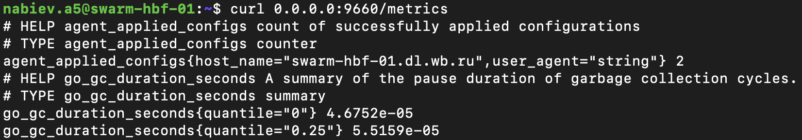

# Мониторинг

Информация о состоянии агента на различных узлах основывается по метрикам [из данной панели Grafana](https://grafana.wildberries.ru/d/wzJE8qKIk/hbf-agent?orgId=1&refresh=5s&from=now-12h&to=now). На ней также настроены уведомления, связанные с недоступностью или некорректной работой агента. Уведомления приходят в закрытый канал в Rocket.chat (#HBF_ALERTS). Таблица ниже описывает возможные для агента уведомления и причины их возникновения.

| Уведомление | Причина уведомления |
| --- | --- |
| Статус health-check равен 0 | Метрика `healthcheck` возвращает значение 0 или по данной метрике отсутствуют значения |
| Потребление CPU стало критически низким (менее 0.150 cores). | Формула расчет потребления CPU связанная с метрикой `process_cpu_seconds_total` возвращает значение ниже 0.150 или по данной метрике отсутствуют значения |
| Потребление RAM подозрительно выросло (более 65 Mb). | Формула расчет потребления RAM связанная с метрикой `process_resident_memory_bytes` возвращает значение выше 65000000 или по данной метрике отсутствуют значения |

## Метрики

Метрики по умолчанию доступны через порт **9660**. Пользователь может настроить порт и другие параметры в разделе "**telemetry**" файла конфигурации ( по умолчанию файл конфигурации находится в */opt/swarm/etc/to-nft* ). Для проверки доступности метрик рекомендуется выполнить команду `curl 0.0.0.0:9660/metrics`.

### Описание метрик

Зеленым цветом выделены ключевые метрики.

| Название метрики | Тип метрики | Описание |
| --- | --- | --- |
| agent_applied_configs | counter | Количество успешно примененных конфигураций |
| go_gc_duration_seconds | summary | Сводка длительности паузы циклов сборки мусора |
| go_gc_duration_seconds_sum | counter | Сумма длительности паузы циклов сборки мусора |
| go_gc_duration_seconds_count | counter | Количество циклов сборки мусора |
|  |  |  |
| go_goroutines | gauge | Количество горутин, существующих в данный момент |
| go_info | gauge | Информация о среде выполнения Go |
| go_memstats_alloc_bytes | gauge | Количество выделенных и еще используемых байтов |
| go_memstats_alloc_bytes_total | counter | Общее количество выделенных байтов, даже если они освобождены |
| go_memstats_buck_hash_sys_bytes | gauge | Количество байтов, используемых хэш-таблицей профилирования |
| go_memstats_frees_total | counter | Общее количество освобождений |
| go_memstats_gc_sys_bytes | gauge | Количество байтов, используемых для метаданных системы сборки мусора |
| go_memstats_heap_alloc_bytes | gauge | Количество выделенных байтов кучи и еще используемых |
| go_memstats_heap_idle_bytes | gauge | Количество байтов кучи в ожидании использования |
| go_memstats_heap_inuse_bytes | gauge | Количество используемых байтов кучи |
| go_memstats_heap_objects | gauge | Количество выделенных объектов |
| go_memstats_heap_released_bytes | gauge | Количество байтов кучи, освобожденных в ОС |
| go_memstats_heap_sys_bytes | gauge | Количество байтов кучи, полученных от системы |
| go_memstats_last_gc_time_seconds | gauge | Количество секунд с 1970 года последней сборки мусора |
| go_memstats_lookups_total | counter | Общее количество запросов указателей |
| go_memstats_mallocs_total | counter | Общее количество выделений памяти |
| go_memstats_mcache_inuse_bytes | gauge | Количество байтов, используемых структурами mcache |
| go_memstats_mcache_sys_bytes | gauge | Количество байтов, используемых структурами mcache, полученных от системы |
| go_memstats_mspan_inuse_bytes | gauge | Количество байтов, используемых структурами mspan |
| go_memstats_mspan_sys_bytes | gauge | Количество байтов, используемых структурами mspan, полученных от системы |
| go_memstats_next_gc_bytes | gauge | Количество байтов кучи, когда произойдет следующая сборка мусора |
| go_memstats_other_sys_bytes | gauge | Количество байтов, используемых для других системных выделений |
| go_memstats_stack_inuse_bytes | gauge | Количество байтов, используемых аллокатором стека |
| go_memstats_stack_sys_bytes | gauge | Количество байтов, полученных от системы для аллокатора стека |
| go_memstats_sys_bytes | gauge | Количество байтов, полученных от системы |
| go_threads | gauge | Количество созданных потоков ОС |
| healthcheck | gauge | Индикатор проверки состояния процесса (0 или 1) |
| process_cpu_seconds_total | counter | Общее количество времени процессора, затраченного в секундах |
| process_max_fds | gauge | Максимальное количество открытых файловых дескрипторов |
| process_open_fds | gauge | Количество открытых файловых дескрипторов |
| process_resident_memory_bytes | gauge | Размер резидентной памяти в байтах |
| process_start_time_seconds | gauge | Время запуска процесса с начала эпохи Unix в секундах |
| process_virtual_memory_bytes | gauge | Размер виртуальной памяти в байтах |
| process_virtual_memory_max_bytes | gauge | Максимальное количество виртуальной памяти в байтах |
| promhttp_metric_handler_errors_total | counter | Общее количество http ошибок, выявленных обработчиком |
