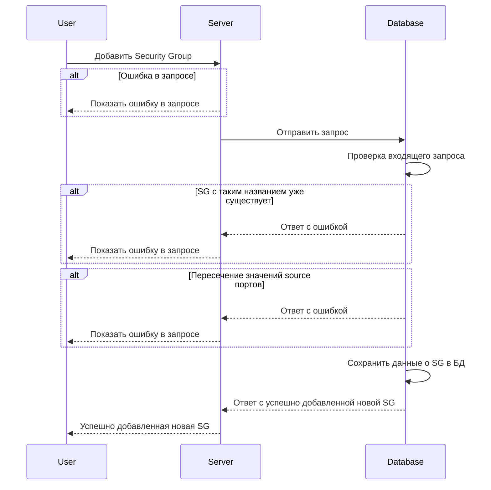

import Tabs from '@theme/Tabs'
import TabItem from '@theme/TabItem'
import { Restrictions } from '@site/src/components/commonBlocks/Restrictions'
import { DICTIONARY } from '@site/src/constants/dictionary.ts'
import { RESTRICTIONS } from '@site/src/constants/restrictions.tsx'

#### Входные параметры

<ul>
  <li>`groups.grous[]` - Структура, содержащая описание создаваемых Security Group</li>
  <li>`groups.groups[].defaultAction` - представляет действие по умолчанию в конце цепочек для SG</li>
  <li>`groups.groups[].logs` - {DICTIONARY.log.short}</li>
  <li>`groups.groups[].name` - {DICTIONARY.sgLocal.short}</li>
  <li>`groups.groups[].networks` - Имена подсетей</li>
  <li>`groups.groups[].trace` - {DICTIONARY.trace.short}</li>
  <li>`sgIcmpRules.rules[]` - {DICTIONARY.rules.short}</li>
  <li>`sgIcmpRules.rules[].ICMP` - {DICTIONARY.apiIcmp.short}</li>
  <li>`sgIcmpRules.rules[].ICMP.IPv` - {DICTIONARY.icmpV.short}</li>
  <li>`sgIcmpRules.rules[].ICMP.Types` - {DICTIONARY.icmpTypes.short}</li>
  <li>`sgIcmpRules.rules[].Sg` - {DICTIONARY.sgLocal.short}</li>
  <li>`sgIcmpRules.rules[].logs` - {DICTIONARY.log.short}</li>
  <li>`sgIcmpRules.rules[].trace` - {DICTIONARY.trace.short}</li>
  <li>`syncOp` - {DICTIONARY.syncOp.short}</li>
</ul>

<table>
  <thead>
    <tr>
      <th rowspan="2">название</th>
      <th rowspan="2">обязательность</th>
      <th rowspan="2">тип данных</th>
      <th rowspan="2">Значение по умолчанию</th>
      <th colspan="2">API request</th>
    </tr>
    <tr>
      <th>groups</th>
      <th>sgIcmpRules</th>
    </tr>
  </thead>
  <tbody>
    <tr>
      <td>groups.groups[]</td>
      <td>да</td>
      <td>Object[]</td>
      <td></td>
      <td class="green center">✔</td>
      <td class="green center"></td>
    </tr>
    <tr>
      <td>groups.groups[].defaultAction</td>
      <td>да</td>
      <td>
        <nobr>Enum("ACCEPT", "DROP")</nobr>
      </td>
      <td></td>
      <td class="green center">✔</td>
      <td class="green center"></td>
    </tr>
    <tr>
      <td>groups.groups[].logs</td>
      <td>нет</td>
      <td>Boolean</td>
      <td>false</td>
      <td class="green center">✔</td>
      <td class="green center"></td>
    </tr>
    <tr>
      <td>groups.groups[].name</td>
      <td>да</td>
      <td>String</td>
      <td></td>
      <td class="green center">✔</td>
      <td class="green center"></td>
    </tr>
    <tr>
      <td>groups.groups[].networks</td>
      <td>нет</td>
      <td>String[]</td>
      <td>[]</td>
      <td class="green center">✔</td>
      <td class="green center"></td>
    </tr>
    <tr>
      <td>groups.groups[].trace</td>
      <td>нет</td>
      <td>Boolean</td>
      <td>false</td>
      <td class="green center">✔</td>
      <td class="green center"></td>
    </tr>
    <tr>
      <td>sgIcmpRules.rules[]</td>
      <td>да</td>
      <td>Object[]</td>
      <td></td>
      <td class="green center"></td>
      <td class="green center">✔</td>
    </tr>
    <tr>
      <td>sgIcmpRules.rules[].ICMP</td>
      <td>да</td>
      <td>Object</td>
      <td></td>
      <td class="green center"></td>
      <td class="green center">✔</td>
    </tr>
    <tr>
      <td>sgIcmpRules.rules[].ICMP.IPv</td>
      <td>да</td>
      <td>Enum("IPv4", "IPv6")</td>
      <td></td>
      <td class="green center"></td>
      <td class="green center">✔</td>
    </tr>
    <tr>
      <td>sgIcmpRules.rules[].ICMP.Types</td>
      <td>нет</td>
      <td>String[]</td>
      <td>[]</td>
      <td class="green center"></td>
      <td class="green center">✔</td>
    </tr>
    <tr>
      <td>sgIcmpRules.rules[].Sg</td>
      <td>да</td>
      <td>String</td>
      <td></td>
      <td class="green center"></td>
      <td class="green center">✔</td>
    </tr>
    <tr>
      <td>sgIcmpRules.rules[].logs</td>
      <td>нет</td>
      <td>Boolean</td>
      <td>false</td>
      <td class="green center"></td>
      <td class="green center">✔</td>
    </tr>
    <tr>
      <td>sgIcmpRules.rules[].trace</td>
      <td>нет</td>
      <td>Boolean</td>
      <td>false</td>
      <td class="green center"></td>
      <td class="green center">✔</td>
    </tr>
    <tr>
      <td>syncOp</td>
      <td>да</td>
      <td>
        <nobr>Enum("Delete", "Upsert", "FullSync")</nobr>
      </td>
      <td></td>
      <td class="green center">✔</td>
      <td class="green center">✔</td>
    </tr>
  </tbody>
</table>

<h4 class="custom-heading">Ограничения</h4>

<ul>
  <li>
    `groups.groups[].name`:
    <Restrictions data={RESTRICTIONS.name} />
  </li>
  <li>
    `groups.groups[].networks[]`:
    <Restrictions data={RESTRICTIONS.cidrSet} />
  </li>
  <li>
    `sgIcmpRules.rules[].Sg`:
    <Restrictions data={RESTRICTIONS.name} />
  </li>
  <li>
    `$node.rules[].type[]`:
    <Restrictions data={RESTRICTIONS.icmpType} />
  </li>
</ul>

#### Пример использования

<Tabs
    defaltValue="sg"
    values={[
        { label: "Security Groups", value: "sg" },
        { label: "ICMP", value: "icmp" }
    ]}
>

    <TabItem value="sg">
        ```bash
        curl '127.0.0.1:9007/v1/sync' \
        --header 'Content-Type: application/json' \
        --data '{
            "groups": {
                "groups": [{
                    "defaultAction": "ACCEPT",
                    "logs": true,
                    "name": "sg-example",
                    "networks": ["10.0.0.0/24", "11.0.0.0/24"],
                    "trace": true
                }]
            },
            "syncOp": "Upsert"
        }'
        ```
    </TabItem>

    <TabItem value="icmp">
        ```bash
        curl '127.0.0.1:9007/v1/sync' \
        --header 'Content-Type: application/json' \
        --data '{
            "sgIcmpRules": {
                "rules": [{
                    "ICMP": {
                        "IPv": "IPv4",
                        "Types": [0,8]
                    },
                    "Sg": "sg-example",
                    "logs": true,
                    "trace": true
                },
                {
                    "ICMP": {
                        "IPv": "IPv6",
                        "Types": [0,8]
                    },
                    "Sg": "sg-example",
                    "logs": true,
                    "trace": true
                }]
            },
            "syncOp": "Upsert"
        }'
        ```
    </TabItem>

</Tabs>

<h4 class="custom-heading">Выходные параметры</h4>

<table>
  <thead>
    <tr>
      <th>название</th>
      <th>тип данных</th>
      <th>описание</th>
    </tr>
  </thead>
  <tbody>
    <tr>
      <td>-</td>
      <td>Object</td>
      <td>в случае успеха возвращается пустое тело</td>
    </tr>
  </tbody>
</table>

<h4 class="custom-heading">Возможные ошибки API</h4>

<details>
    <summary>Ошибка в запросе</summary>

    ```json
    {
        "code": 5,
        "details":  [],
        "message": "Not Found"
    }
    ```

</details>

<details>
    <summary>Добавление несуществующего Network</summary>

    ```json
    {
        "code": 13,
        "message": "ERROR: unable bind Net(nw-nonexist)-->SG(sg-with-nonexist-nw) cause such Net does not exist (SQLSTATE P0001)",
        "details": []
    }
    ```

</details>

<details>
    <summary>некорректное значение поля networks</summary>

    ```json
    {
        "code": 3,
        "message": "proto: syntax error (line 6:29): unexpected token \"nw-test-0\"",
        "details": []
    }
    ```

</details>

<details>
    <summary>некорректное значение поля defaultAction</summary>

    ```json
    {
        "code": 3,
        "message": "proto: (line 9:34): invalid value for enum type: \"QWERTY\"",
        "details": []
    }
    ```

</details>

<h4 class="custom-heading">Диаграмма последовательности</h4>


